# Communospheres

*Living spaces that maintain consciousness resonance and enable collective awareness*

## Overview

Communospheres represent a revolutionary approach to living spaces—spherical structures that maintain a specific resonant frequency, keeping inhabitants consciously connected to each other and the city's collective awareness field.

**Origin**: This concept comes from the city of Delphin on planet Israel, as shared through contact/channeling. It provides a concrete example of how higher-consciousness civilizations structure their living environments.

### Visual Reference

Your original vision of Light City showing the spherical communosphere concept:

Delphin's actual communospheres as they appear from above (aerial view showing multiple spheres):

---

## Core Concept

A communosphere is:
- **Physical**: A large spherical structure
- **Energetic**: A resonance-maintaining chamber
- **Social**: A complete community living environment
- **Technological**: A consciousness-connection device

It's simultaneously architecture, energy technology, and consciousness tool.

## Key Characteristics

*Detailed cross-section showing all interior levels, living spaces, and the central resonance core.*

### Physical Structure

**Shape**: Spherical (dome visible from exterior)

**Size**: 
- Large enough for complete communities (example: 10,000 people)
- Self-contained living environment
- Multiple levels/floors within the sphere

**Construction**:
- "Hooked in" to the ground—firmly anchored
- Likely crystalline or crystal-integrated materials
- Semi-transparent or translucent (based on Delphin images)
- Designed to maintain specific energetic properties

**Location**: Positioned around the city's perimeter/outer ring

### Energetic Function

**Primary Purpose**: Maintain resonant frequency

**How It Works**:
1. Central city spire generates/holds base frequency
2. Communospheres receive and maintain this frequency
3. Living spaces within sphere hold steady resonance
4. Inhabitants remain "consciously connected" through this field

**Field Effects**:
- Creates coherent consciousness environment
- Enables telepathic/energetic connection
- Maintains elevated awareness state
- Supports instant knowledge transfer

### Social Structure

**Community Scale**: Complete self-sufficient communities

**Population**: 
- Delphin example: ~10,000 people per sphere
- Large enough for diversity and culture
- Small enough for genuine community
- Optimal size for conscious connection

**Living Arrangement**:
- Multiple families/individuals per sphere
- Shared community spaces
- Private living quarters
- Integrated amenities and services

#### Communosphere Structure Diagram

```mermaid
graph TB
    subgraph CS["🔮 Communosphere<br/>Single Living Sphere"]
        subgraph Inner["Inner Spaces"]
            CA["💫 Central Commons<br/>Gathering Space"]
            LP["📚 Learning Plaza<br/>Knowledge Transfer"]
            MC["🎨 Creative Chambers<br/>Expression & Art"]
        end
        
        subgraph Living["Living Quarters"]
            PQ["🏠 Private Quarters<br/>Individual/Family"]
            SCS["🤝 Shared Community<br/>Services"]
        end
        
        subgraph Support["Support Systems"]
            Water["💧 Water Systems"]
            Air["🌬️ Air Systems"]
            Energy["⚡ Energy Systems"]
        end
        
        CA -.->|Consciousness<br/>Connection| PQ
        LP -->|Knowledge<br/>Transfer| PQ
        MC -->|Creative<br/>Expression| PQ
        
        Water -->|Sustains| PQ
        Air -->|Sustains| PQ
        Energy -->|Powers| CA
        Energy -->|Powers| LP
        Energy -->|Powers| MC
    end
    
    style CS fill:#e6f3ff,stroke:#667eea,stroke-width:3px,color:#333
    style CA fill:#b0e0e6,stroke:#333
    style LP fill:#b0e0e6,stroke:#333
    style MC fill:#b0e0e6,stroke:#333
    style PQ fill:#a0d8ff,stroke:#333
    style SCS fill:#a0d8ff,stroke:#333
    style Inner fill:#f0f8ff,stroke:#667eea,stroke-width:2px
    style Living fill:#f0f8ff,stroke:#667eea,stroke-width:2px
    style Support fill:#fffacd,stroke:#daa520,stroke-width:2px
```

---

### Consciousness Technology

**Collective Awareness**:
- Inhabitants maintain constant connection
- "They all know the same thing"
- Knowledge learned by anyone transfers to all
- Unity consciousness in practice

**Knowledge Transfer System**:
- Learning in "elevated knowledge form" 
- Automatic transmission through resonance field
- Instantaneous reception by all connected beings
- No traditional teaching required for information

## Applications to Light City

### Design Implications

**Layout**:
- Position communospheres in outer ring(s)
- Connect to central spire energetically
- Arrange in geometric pattern (circle, 12 positions, etc.)
- Pathways connecting to central area

**Number**: 
- Depends on total intended population
- 12 spheres for sacred number alignment?
- Each housing 5,000-10,000 people
- Total city population: 60,000-120,000

**Architecture**:
- Geodesic dome or sphere structure
- Crystal or crystalline material integration
- Semi-transparent to allow light
- Beautiful, inspiring design

### Energetic System

**Frequency Generation**:
- Central spire generates base frequency
- Distributed through geometric grid
- Each communosphere acts as receiver/amplifier
- Creates unified field across entire city

**Maintenance**:
- Passive system once established
- Self-regulating through geometry and materials
- Consciousness of inhabitants strengthens field
- Regular ceremonies/intentions to reinforce

### Social Organization

**Community Structure**:
- Each sphere develops its own culture within unity
- Self-governance at sphere level
- Connection to city-wide governance
- Balance of autonomy and unity

**Interaction**:
- Daily life primarily within sphere
- Journey to center for ceremonies, work, learning
- Inter-sphere connection and visiting
- Maintained awareness of whole while living in part

### Practical Considerations

**Services Within Sphere**:
- Food preparation and dining
- Basic healthcare
- Recreation and gathering spaces
- Creative studios
- Small-scale gardens
- Childcare and education

**Services Requiring Central Access**:
- Advanced learning centers
- Major ceremonies and gatherings
- Specialized healing temples
- Large-scale production
- Administration and coordination

## Comparison to Other Models

### vs. Traditional Neighborhoods
- **Traditional**: Geographic proximity, limited connection
- **Communosphere**: Energetic connection, conscious unity

### vs. Intentional Communities
- **Intentional**: Shared values, some connection
- **Communosphere**: Shared consciousness field, deep connection

### vs. Apartment Buildings
- **Apartments**: Isolated units in shared structure
- **Communosphere**: Connected beings in unified field

## Technical Specifications

### Size Calculations

**For 10,000 People**:
- Assume 400-600 sq ft per person average
- Total: 4-6 million sq ft
- Multi-level structure: 5-10 levels
- Per level: 500,000-1,200,000 sq ft
- Diameter (rough): 800-1,200 feet
- Height: 400-600 feet

**Variation by Population**:
- 5,000 people: ~600-900 ft diameter
- 7,500 people: ~700-1,000 ft diameter
- 10,000 people: ~800-1,200 ft diameter

### Materials Research Needed

**Properties Required**:
- Structural strength for large sphere
- Resonance-maintaining characteristics
- Light transmission/refraction
- Energetic coherence
- Durability and longevity
- Beauty and inspiration

**Candidate Materials**:
- Crystal (quartz, others)
- Advanced glass/ceramics
- Crystalline metals
- Biomaterials
- Composite structures
- Frequency-tuned materials

## Construction Approach

### Physical Construction

**Method 1: Geodesic Dome Principles**
- Triangulated structure for strength
- Modular construction
- Scalable to large sizes
- Proven technology (Buckminster Fuller)

**Method 2: Advanced Materials**
- Self-assembling materials
- Crystalline growth processes
- Consciousness-directed construction
- Hybrid biological-technological

**Method 3: Staged Construction**
- Begin with foundation and frame
- Build floor by floor
- Install systems progressively
- Activate energetically when complete

### Energetic Activation

**Process**:
1. Complete physical structure
2. Install crystal/resonance technology
3. Connect to central spire grid
4. Ceremony to activate field
5. Gradual population as field stabilizes
6. Conscious intention strengthens over time

## Living Experience

### Daily Life in a Communosphere

**Morning**:
- Wake in resonant field—natural alignment
- Shared breakfast with neighbors
- Check in with collective awareness
- Choose day's activities

**Daytime**:
- Work or create within sphere or journey to center
- Learning happens spontaneously through field
- Collaboration flows naturally from connection
- Children learn through play and presence

**Evening**:
- Community gathering or quiet reflection
- Share meals and experiences
- Ceremony or celebration
- Rest in coherent field

### Personal Space vs. Collective

**Balance**:
- Private living quarters for individuals/families
- Shared common areas for community
- Both honor personal needs and collective connection
- Conscious choice of engagement level

## Challenges and Considerations

### Potential Issues

1. **Privacy**: How much is possible/desirable in unified field?
2. **Individuality**: Maintaining unique expression within unity
3. **Scale**: Finding optimal size for connection and autonomy
4. **Technology**: Developing resonance-maintaining systems
5. **Materials**: Sourcing or creating appropriate materials
6. **Cost**: Significant investment for each sphere

### Solutions to Explore

1. **Privacy**: Different field intensity zones within sphere
2. **Individuality**: Unity consciousness includes diversity
3. **Scale**: Test with smaller prototypes, scale up
4. **Technology**: Research crystal energy, sacred geometry
5. **Materials**: Phased approach—start simple, upgrade
6. **Cost**: Community investment, phased construction

## Research Priorities

### Immediate (Stage 1-2)
- [ ] Design initial communosphere concept
- [ ] Determine appropriate scale for Light City
- [ ] Research resonance and frequency technologies
- [ ] Study geodesic dome construction
- [ ] Explore material options

### Near-term (Stage 3-4)
- [ ] Create detailed architectural plans
- [ ] Develop resonance system specifications
- [ ] Design interior layouts
- [ ] Plan community structure within spheres
- [ ] Prototype small-scale resonance chamber

### Long-term (Stage 5-6)
- [ ] Construct first communosphere
- [ ] Test and refine resonance systems
- [ ] Establish first community
- [ ] Document living experience
- [ ] Build additional spheres

## Connection to Other Concepts

### Related Documents
- [Architecture](/docs/design/architecture) - Overall city design
- [Sacred Geometry](/docs/concepts/sacred-geometry) - Sphere significance
- [Energy Systems](/docs/concepts/energy-systems) - Resonance technology
- [Core Concepts](/docs/concepts/core-concepts) - Unity consciousness

### Integration Points
- Communospheres are key component of Light City layout
- They embody unity consciousness principles
- They demonstrate sacred geometry (sphere, perfect form)
- They integrate spiritual and practical

## Inspiration and Validation

The communosphere concept comes from actual implementation in Delphin, demonstrating:

1. **It's possible** - Already exists on other worlds
2. **It works** - Functional system for consciousness connection
3. **It's scalable** - Large populations can live this way
4. **It's practical** - Meets both physical and spiritual needs
5. **It's the model** - Example for Earth implementation

This isn't speculation—it's adaptation of proven technology.

---

**Status**: New concept document based on Delphin information  
**Created**: October 10, 2025  
**Priority**: High - Core architectural component  
**Next Steps**: Integrate into architecture.md, develop detailed designs

