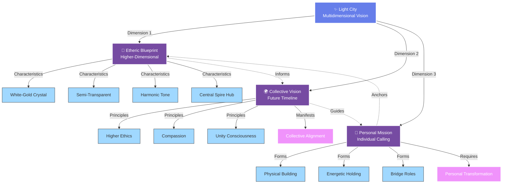

# Core Concepts

This document outlines the foundational concepts and principles of the Light City project.

:::info Scope & Framing
This page blends visionary language with practical design cues. Spiritual descriptions are presented as the project's working lens. **All physical infrastructure on Earth follows standard engineering, permitting, and safety practices.** For implementation details, see [Architecture](/docs/design/architecture), [Energy Systems](/docs/concepts/energy-systems), and [Development Stages](/docs/project/development-stages).
:::

## Vision

:::tip How to Read This Page
This is a **conceptual primer**. Take metaphysical language as **design intent**; take implementation details from the **Architecture**, **Development Stages**, and **Energy Systems** pages. Where claims could be controversial, we tag them as **hypotheses** and defer to peer-reviewed evidence.
:::

Your original Light City visions that sparked this project:

---

## What is Light City?

Light City is a multidimensional vision that exists simultaneously across several planes of reality:

### Light City Dimensions

---

### 1. The Etheric Blueprint

We describe Light City as an **etheric template**—a pattern referenced in certain spiritual traditions and accessible through contemplative practice. In this lens, the city's forms (white-gold crystalline geometries, harmonic tone, central spire) orient our design metaphors and community rituals.

**Key Attributes:**
- White-gold crystalline architecture
- Semi-transparent, light-refracting structures
- Emits a soft harmonic tone (like singing bowls layered)
- Circular layout with central spire as communication hub
- Connects to both cosmic and terrestrial energies

### 2. The Collective Vision

Light City represents a **future potential timeline** where human civilization operates from:

- **Higher Ethics**: Decisions based on unity consciousness and collective good
- **Compassion**: Empathy and care as foundational principles
- **Unity**: Recognition of fundamental interconnection

This is not a utopia (which means "no place") but a **collective choice point**—a potential reality that manifests when enough individuals align their vision and actions.

### 3. The Personal Mission

Light City is also a **personal calling**—the sense that you are meant to help build something, either:

- **Physically**: Creating actual structures, communities, or institutions
- **Energetically**: Holding the vision, teaching principles, inspiring others
- **Both**: Bridging the spiritual blueprint with material reality

> *"To build it on Terra, begin building it in hearts. Structures follow spirit."*

## Core Principles

### 1. Spirit Before Structure

**Principle**: The internal transformation must precede external manifestation.

Before we can build Light City physically, we must:
- Embody its principles personally
- Cultivate higher consciousness
- Practice unity, compassion, and ethical action
- Build the "city" first as an internal reality

**Application**: This project begins with documentation, vision, and principle—not with construction plans. The structure follows when the spirit is ready.

### 2. Gaia's Memory

**Principle**: The blueprint already exists in Earth's energetic field.

Light City is not invented but **remembered and anchored**:
- The pattern exists in what some call Gaia's memory or the Akashic field
- Our work is to attune to this pattern
- We download, interpret, and manifest what already exists in potential
- Individual visions of Light City may vary but share core resonance

**Application**: Approach this work as *discovery* rather than pure creation. Listen, attune, and receive guidance.

### 3. Collective Co-Creation

**Principle**: Light City manifests through collective alignment, not individual control.

This is not one person's vision imposed on others, but:
- A shared dream that many hold
- Co-created through collaboration and contribution
- Emerges from collective resonance
- Respects diverse expressions within unified principles

**Application**: This project welcomes contributions, variations, and different expressions of the core vision.

### 4. Multi-Dimensional Integration

**Principle**: Bridge the spiritual and material, etheric and physical.

Light City exists across dimensions:
- **Spiritual**: Consciousness, intention, vision
- **Energetic**: Subtle fields, sacred geometry, vibrational patterns
- **Mental**: Ideas, documentation, plans
- **Emotional**: Inspiration, connection, community
- **Physical**: Actual structures, gatherings, institutions

**Application**: Work on all levels simultaneously. Don't wait for physical manifestation to begin the work.

### 5. Higher-Vibrational Living

**Principle**: Light City operates at a higher frequency than current paradigms.

This means:
- Decisions from unity consciousness vs. separation
- Abundance mindset vs. scarcity
- Collaboration vs. competition
- Service vs. exploitation
- Regeneration vs. extraction

**Application**: Practice these principles in current life as training for Light City citizenship.

## The Architecture of Light

### Physical/Visual Description

**Materials**: 
- Crystalline structures (literal or metaphorical)
- Semi-transparent to allow light passage
- White-gold coloring
- Refracts light into rainbow patterns

**Layout**:
- **Circular design** with concentric rings
- **Central spire/pillar** acting as:
  - Communication hub with cosmos
  - Grounding point with Earth's grid
  - Symbolic and functional axis mundi
- **Radial pathways** connecting center to periphery
- **Sacred geometry** underlying all design

**Energy**:
- The entire city **hums** with harmonic resonance
- Light and sound work together
- Creates a field that elevates consciousness
- Self-sustaining energetic system

> **Terminology Clarification:** Here "energetic" denotes **experiential resonance** (light/sound/coherence), not electrical baseload. **Physical electrical power** is provided by a renewable **microgrid** (PV + batteries + backup); see [Energy Systems](/docs/concepts/energy-systems) for details.

### Energetic/Metaphysical Description

**Purpose**: 
Acts as a **convergence point** between:
- Awakened humanity and higher consciousness
- Visiting benevolent extraterrestrial civilizations
- Earth's crystalline grid and cosmic energies
- The physical and etheric planes

**Function**:
- Embassy for consciousness exchange
- Healing and transformation center
- Teaching and learning hub
- Demonstration of higher-paradigm living
- Anchor point for new Earth frequencies

## Key Questions

### Is Light City Guaranteed?

**No.** Light City exists as a **potential timeline**, not a certainty. 

It manifests through collective choice:
- If enough individuals hold the vision
- If enough people embody the principles
- If humanity collectively chooses unity over separation

> **Your contribution** (skills, stewardship, research, resources) is what collapses potential into buildable plans. This is an invitation to agency, not a guarantee.

### How Do We Build It?

**Three levels of work:**

1. **Inner Work**: Personal transformation and consciousness evolution
2. **Visionary Work**: Holding the vision, documenting, teaching, inspiring
3. **Manifest Work**: Physical creation when spirit, timing, and resources align

The mistake is skipping levels 1 and 2 to rush to level 3.

### Where Does It Exist?

**Multiple locations:**

- **Etherically**: In Earth's higher-dimensional field, accessible through meditation and vision
- **Other Worlds**: Already manifested on other planets (e.g., Delphin on planet Israel)
- **Potentially**: In physical locations on Earth where conditions align (to be discovered)
- **Metaphorically**: In communities and hearts that embody the principles
- **Literally**: In future physical structures built on these principles

**Validation**: The discovery of Delphin—an existing crystal city on another planet with a 40,000-foot crystal spire (off-world scale, not Earth-feasible) and communosphere living spaces—confirms that Light City is not fantasy but an archetypal pattern already implemented elsewhere. Light City's Earth implementation will use scaled, buildable versions (60-300m spire).

### Who Is This For?

**Anyone who:**
- Feels called to create a higher way of living
- Senses connection to the vision
- Wants to contribute to humanity's evolution
- Seeks to bridge spiritual and material
- Recognizes themselves as a builder of new Earth

## Relation to Other Concepts

Light City resonates with and connects to:

- **New Earth**: The evolving higher-frequency Earth timeline
- **5D Consciousness**: Unity consciousness, heart-centered living
- **Ascension**: Personal and collective spiritual evolution
- **Sacred Architecture**: Structures designed for consciousness elevation
- **Intentional Communities**: Physical communities with shared values
- **Cosmic Citizenship**: Humanity's connection with broader galactic family
- **Extraterrestrial Models**: Cities like Delphin that demonstrate the archetype

## Delphin (Off-World Archetype, Inspirational Reference)

Recent contact information reveals **Delphin**—a crystal city on planet Israel (another star system) that embodies the Light City archetype:

- **40,000-foot crystal spire** (off-world scale, ~12 km tall) generating power and consciousness frequency
- **Communospheres**: Large spherical living spaces (600-1,200 ft diameter) maintaining resonance
- **Knowledge transfer system**: Learning by one transfers to all
- **Unified consciousness field**: All inhabitants consciously connected
- **Archetypal reference from off-world narrative sources**: We treat it as design inspiration, not empirical proof

**Important**: Delphin represents a mythic/visionary implementation of the archetype. Light City's **Earth implementation** uses **scaled, buildable versions** within Earth engineering standards:
- **Spire**: 60-300m (200-1,000 ft) instead of 40,000 ft
- **Communospheres**: 30-60m (100-200 ft) diameter instead of 600-1,200 ft
- **Same principles**, different scale appropriate for Earth physics and construction
- **Proven technologies**: Solar PV, battery storage, CLT/steel structures, BIPV glazing (see [Technology Catalog](/docs/technical/technology-catalog))

This archetype validates that Light City is accessing a coherent design pattern, not creating from imagination alone.

*See [Communospheres](/docs/concepts/communospheres) for details*

## Living Questions

These questions guide ongoing exploration:

1. What specific principles should govern Light City?
2. What would daily life look like in Light City?
3. How do we prepare ourselves to be worthy inhabitants?
4. What technologies (ancient and modern) support the vision?
5. How do we handle governance, resources, and decisions?
6. What role does Light City play in humanity's larger story?
7. How do different cultural traditions inform the vision?

---

## Next Steps

To deepen your understanding:

1. Read [Philosophy](/docs/concepts/philosophy) for deeper conceptual exploration
2. Explore [Architecture](/docs/design/architecture) for physical/energetic design
3. Review [Purpose and Mission](/docs/concepts/purpose-and-mission) for project goals
4. Study [Sacred Geometry](/docs/concepts/sacred-geometry) for underlying patterns

### Next Actions by Role

**If you're a builder/engineer:**
- Jump to [Development Stages](/docs/project/development-stages) to see gates, TRLs, and budgets
- Review [Technology Catalog](/docs/technical/technology-catalog) for proven technologies
- Check [Architecture](/docs/design/architecture) for specifications and phasing

**If you're a researcher/experience curator:**
- See [Energy Systems](/docs/concepts/energy-systems) for metrology, ethics, and consent UI
- Explore measurement protocols and research hygiene standards
- Review IRB requirements and human-subject research frameworks

**If you're an architect/designer:**
- Study [Architecture](/docs/design/architecture) for scale, heights, and typologies
- Review [Sacred Geometry](/docs/concepts/sacred-geometry) for design principles
- Check [Visual Language](/docs/design/visual-language) for design tokens

**If you're interested in urban retrofits:**
- See [Urban Retrofit Guide](/docs/technical/urban-retrofit-guide) for applying Light City principles to existing cities
- Review policy interventions, district strategies, and building-level upgrades

---

**Last Updated**: November 7, 2025  
**Last Reviewed**: November 7, 2025  
**Owner**: Core Team  
**Related**: [Architecture](/docs/design/architecture), [Energy Systems](/docs/concepts/energy-systems), [Development Stages](/docs/project/development-stages)

---

**📝 [Edit this page on GitHub](https://github.com/szemkoff/light-city-project/edit/main/website/docs/concepts/core-concepts.md)** | **📊 [View Updates](/blog)**  
**Related Documents**: [Philosophy](/docs/concepts/philosophy), [Architecture](/docs/design/architecture), [Development Stages](/docs/project/development-stages)

