# Energy Systems

*This document explores the energy generation, distribution, and consciousness technologies of Light City*

**Status**: Research & Development  
**Last Updated**: November 7, 2025  
**Owner**: Technical Working Group  
**Related**: [Architecture](/docs/design/architecture), [Technology Catalog](/docs/technical/technology-catalog), [Development Stages](/docs/project/development-stages)

---

## ⚠️ Claim Discipline

**This page integrates visionary concepts with practical engineering.** All non-conventional mechanisms (zero-point/scalar/torsion/consciousness-coupled power) are **research hypotheses (TRL 1–3)**; all essential electricity comes from a **conventional microgrid** until peer-reviewed evidence says otherwise.

**Scope Discipline**: Physical microgrid provides all essential power. Resonance/spire systems are research-grade (TRL 1–3) that influence human experience (light/acoustics) and may augment ecosystems but are **not relied on for baseload power**.

---

## Overview: Two-Track Energy System

Light City operates on multiple energy levels simultaneously, with clear separation between proven and exploratory technologies:

### Track 1: Physical Energy (Conventional — TRL 6-9)

**Purpose**: Powers all essential systems (lighting, HVAC, kitchens, labs, communications)

**Sources**:
- Solar PV (rooftop, canopies, BIPV)
- Battery storage (lithium-ion or flow batteries)
- Backup generator (diesel/propane for resilience)
- Grid interconnect (if available)

**Status**: Proven, permittable, fundable  
**Budget**: $3M-$10M (Phase 1: 2-5 MWp + 8-20 MWh storage)

### Track 2: Subtle/Consciousness Energy (Research — TRL 1-3)

**Purpose**: Influences human experience, acoustics, lighting programs, ceremonial UX

**Mechanisms** (hypothetical):
- Crystal resonance and piezoelectric effects
- Sacred geometry standing waves
- Consciousness field coherence
- Exploratory: Zero-point/scalar/torsion (no baseload claims)

**Status**: Experimental, requires measurement protocols  
**Budget**: $100K-$500K (Phase 1 research, instrumentation)

---

## Visual Reference

Your visionary conception of Light City's crystalline energy architecture:

Delphin's crystal spire and energy system in action (visible as the central glowing structure):

**Note**: Delphin represents an off-world reference model with advanced technology. Light City's Earth implementation uses the two-track system above.

---

## Track 1: Physical Microgrid (Conventional Power)

### Architecture

**Generation**:
- **Solar PV**: 2-5 MWp (Phase 1), 5-15 MWp (Phase 2)
  - Rooftop arrays on communospheres, temples, studios
  - Parking canopies (dual function: shade + power)
  - BIPV on spire facade and select buildings
- **Storage**: 8-20 MWh (Phase 1), 40-80 MWh (Phase 2)
  - Lithium-ion (4-hour duration) or flow batteries (8-12 hour)
  - Day-to-night load shifting
  - Peak shaving and grid services (if interconnected)
- **Backup**: 500 kW - 2 MW diesel/propane genset
  - 7-14 days fuel storage on-site
  - Automatic transfer switch
  - Emissions controls (Tier 4 Final)

**Distribution**:
- **AC Feeders**: 480V 3-phase for heavy loads (HVAC, kitchens, workshops)
- **LVDC Ring**: 48V DC for LED lighting, controls, sensors (higher efficiency)
- **Microgrid Controller**: Islanding capability, load shedding, optimization
- **Smart Meters**: Real-time monitoring per building/circuit

**Connection Points**:
- Each communosphere: 200-500 kW peak demand
- Temples: 50-150 kW
- Studios/Maker spaces: 100-300 kW
- Central spire: 50-200 kW (lighting, elevators, observation deck)
- Infrastructure: 100-300 kW (water, wastewater, roads)

### Metrology & Monitoring (Physical Layer)

**Power Quality**:
- **kWh/kWp**: Solar yield (target: 1,400-1,800 kWh/kWp/year)
- **Uptime**: 99.5%+ availability
- **Round-trip efficiency**: Battery 85-90%
- **THD**: Total harmonic distortion &lt;5% (IEEE 519)

**Instrumentation**:
- Revenue-grade meters (ANSI C12.20 Class 0.2)
- Inverter monitoring (SolarEdge, Enphase, SMA)
- Battery management system (BMS) telemetry
- Weather station (irradiance, temperature, wind)

**Dashboard**: Real-time web interface showing generation, storage, consumption, and carbon offset.

---

## Track 2: Subtle/Consciousness Energy (Research)

### The Crystal Spire: Symbolic + Auxiliary Role

**Primary Functions** (Terrestrial Model):
- **Ceremonial signaling**: Programmable LED lighting visible for miles
- **Acoustic resonance**: Generates harmonic tones (Schumann, Solfeggio frequencies)
- **Wayfinding beacon**: Visual and energetic landmark
- **Research platform**: Consciousness field studies, instrumentation

**NOT Primary Function**: Baseload power generation (that's the microgrid's job)

**Research Focus**: Resonance coherence metrics, consciousness field effects, not generation claims

### Possible Mechanisms (Hypothetical — TRL 1-3)

| Mechanism | Status | TRL | Primary Measure | Safety/Ethics |
|-----------|--------|-----|-----------------|---------------|
| **Crystal resonance / piezo effects** | Literature + benchtop | 2-3 | Q-factor, frequency stability, micro-strain | Field strengths/EMC compliance |
| **Sacred-geometry standing waves** | Concept + acoustic models | 1-2 | Room RT60, modal patterns, listener HRV/EEG | SPL limits (&lt;85 dBA, &lt;45 dBA night) |
| **Zero-point / scalar / torsion** | Exploratory hypotheses | 1 | **No baseload claims**; null tests, anomaly detection | Thermal/EM exposure limits |
| **Consciousness coupling** | Human-subject research | 1-2 | HRV, EEG, heart-brain coherence, group coherence | IRB approval, informed consent, opt-out |

**Research Hygiene**:
- Preregistered protocols (Open Science Framework)
- Blinded/sham sessions where applicable
- Third-party observers and replication
- Publish null results (no p-hacking)
- Public datasets (anonymized)

### Resonant Frequency System

**Acoustic Targets**:
- **Main hall**: RT60 1.6-2.0 s (music, ceremonies)
- **Meditation rooms**: RT60 0.3-0.5 s (clarity, focus)
- **Exterior soundscape**: ≤ 45 dBA at night (residential areas)
- **Frequency stability**: ±10 ppm (crystal oscillator)

**Physiological Targets** (measured in controlled studies):
- **HRV increase**: 10-20% during resonance sessions (vs. baseline)
- **EEG coherence**: Alpha (8-12 Hz) and gamma (40 Hz) band coherence
- **Heart-brain coherence**: Measured via HeartMath protocols
- **Subjective**: Validated questionnaires (POMS, STAI, mindfulness scales)

**Instrumentation**:
- Spectrum analyzer (FFT, 1 Hz - 20 kHz)
- RT60 measurement system (impulse response, decay time)
- Wearable biosensors (Oura, Whoop, Muse, HeartMath)
- Environmental sensors (temp, humidity, CO₂, EMF)

### Knowledge Transfer Research

*How information flows from individual learning through the resonance field to instant collective reception.*

**Delphin Model** (Off-World Reference): "Whatever they learn in some elevated knowledge form gets transferred to all of the spheres. So they all know the same thing."

**Research Approach**: We treat "field-mediated learning" as a **testable phenomenon**:
- **Preregistered protocols**: Hypothesis, methods, analysis plan published before data collection
- **Sham sessions**: Control groups with no resonance field active
- **Third-party observers**: Independent researchers verify results
- **Public datasets**: Anonymized data available for replication
- **Outcomes inform pedagogy**: Not claims of "instant download," but enhanced learning environments

**Measurement**:
- Learning speed (time to mastery)
- Retention (recall after 1 week, 1 month)
- Transfer (apply to new contexts)
- Group coherence (synchronized brainwaves during learning)
- Subjective experience (phenomenological interviews)

**Ethics**:
- Informed consent (detailed disclosure of experimental nature)
- Right to withdraw (no penalty)
- Privacy (thoughts are not "broadcast" without consent)
- Opt-out zones (quiet rooms, no-program hours)

---

## Dual-Stack Architecture Diagram

```mermaid
graph TD
    subgraph "PHYSICAL MICROGRID (Proven — TRL 6-9)"
        PV["☀️ Solar PV<br/>2-5 MWp"]
        BATT["🔋 Battery Storage<br/>8-20 MWh"]
        GEN["⚡ Backup Genset<br/>500 kW - 2 MW"]
        
        PV --> BATT
        GEN --> BATT
        BATT --> AC["🔌 AC Feeders<br/>480V 3-phase"]
        BATT --> DC["💡 LVDC Ring<br/>48V DC"]
        
        AC --> LOADS_AC["Heavy Loads:<br/>HVAC, Kitchens, Workshops"]
        DC --> LOADS_DC["Lighting, Controls, Sensors"]
    end
    
    subgraph "SUBTLE/RESONANCE OVERLAY (Research — TRL 1-3)"
        SPIRE["🔮 Crystal Spire<br/>Acoustic + Light Programs"]
        GEOM["✨ Sacred Geometry<br/>Standing Waves"]
        
        SPIRE -.->|Influences| LIGHT["🌟 Circadian Lighting<br/>Tunable White LEDs"]
        SPIRE -.->|Influences| SOUND["🎵 Acoustic Environment<br/>RT60, Harmonics"]
        GEOM -.->|Influences| SPACE["🏛️ Spatial Experience<br/>Resonance Chambers"]
        
        LIGHT -.->|Measured| BIO["📊 Biosensors<br/>HRV, EEG, Coherence"]
        SOUND -.->|Measured| BIO
        SPACE -.->|Measured| BIO
    end
    
    style PV fill:#FFD700,stroke:#333
    style BATT fill:#4169E1,stroke:#333
    style GEN fill:#DC143C,stroke:#333
    style SPIRE fill:#9370DB,stroke:#fff,color:#fff
    style GEOM fill:#BA55D3,stroke:#fff,color:#fff
    style BIO fill:#32CD32,stroke:#333
```

**Key**: Solid lines = proven power flow. Dashed lines = research/influence pathways.

---

## Energy Distribution: Physical Grid

**The Grid System** (Conventional):
- **Primary**: AC feeders from battery inverters to building distribution panels
- **Secondary**: LVDC ring for efficient LED lighting and controls
- **Tertiary**: Building-level sub-panels with circuit breakers and monitoring

**Connection Points**:
- Each communosphere: Dedicated 200-500 kW service entrance
- Temples and major buildings: 50-300 kW services
- Spire: 50-200 kW (lighting, elevators, observation deck)
- Infrastructure: 100-300 kW (water pumps, wastewater, street lighting)

**No Wireless Power Transmission**: All physical power via conventional wiring (copper/aluminum conductors, conduit, code-compliant)

**"Subtle Grid" Overlay**: Lighting programs, acoustic systems, and ceremonial UX influenced by sacred geometry and resonance research, but **not** carrying baseload power.

---

## Metrology & Measurement (All Layers)

### Physical Energy (Conventional)

**Meters Installed**:
- Revenue-grade power meters (per building, per circuit)
- Inverter monitoring (real-time generation)
- Battery BMS (state of charge, health, cycles)
- Weather station (solar resource, temperature)

**KPIs**:
- Solar yield: 1,400-1,800 kWh/kWp/year
- Battery round-trip efficiency: 85-90%
- Uptime: 99.5%+
- Power quality: THD &lt;5%
- Cost per kWh: $0.10-$0.15 (levelized)

### Resonance/Acoustic Layer

**Instrumentation**:
- Spectrum analyzer (FFT, 1 Hz - 20 kHz)
- RT60 measurement system (impulse response)
- SPL meters (sound pressure level, dBA)
- Frequency stability monitor (crystal oscillator)

**Targets**:
- Main hall RT60: 1.6-2.0 s
- Meditation rooms RT60: 0.3-0.5 s
- Exterior soundscape: ≤ 45 dBA night
- Frequency drift: ±10 ppm

### Consciousness Field Layer

**Protocols**:
- Wearable biosensors (HRV, EEG, sleep quality)
- Validated questionnaires (POMS, STAI, mindfulness)
- Group coherence measurements (synchronized brainwaves)
- Phenomenological interviews (qualitative)

**Targets**:
- HRV increase: 10-20% during sessions
- EEG alpha/gamma coherence: Measurable increase
- Subjective well-being: 15%+ improvement (surveys)
- Learning speed: 10-30% faster (controlled studies)

**Ethics**: IRB-approved protocols, informed consent, opt-out available, privacy protected.

---

## Safety and Ethics

### Physical Safety

**Electrical**:
- NEC (National Electrical Code) compliance
- Arc-flash protection (PPE, labeling)
- Ground-fault protection (GFCI, AFCI)
- Lockout/tagout procedures (maintenance)

**EMF**:
- ICNIRP guidelines (100 µT for 50/60 Hz fields)
- Shielding where needed (substations, inverters)
- Monitoring and signage

**Acoustic**:
- OSHA limits (85 dBA 8-hour TWA)
- Hearing protection available (workshops, events)
- Quiet hours (10 PM - 7 AM, &lt;45 dBA)

### Consciousness/Resonance Safety

**Consent**:
- **Opt-in by default**: Residents choose to participate in resonance programs
- **Consent UI**: Physical/digital toggle for "participate in resonance programs"
- **Opt-out zones**: Quiet rooms, no-program hours (daily 10 PM - 7 AM)
- **Sensitive groups**: Children, pregnant women, neurological conditions (extra caution)

**Privacy**:
- Thoughts are **not** broadcast without explicit consent
- No "mind reading" or surveillance via consciousness field
- Individual sovereignty maintained (unity AND autonomy)

**Autonomy**:
- Right to disconnect (leave resonance field anytime)
- No penalty for opting out
- Alternative spaces available (shielded rooms if needed)

**Ethics Review**:
- IRB approval for all human-subject research
- Informed consent (detailed disclosure)
- Regular ethics audits (community council)
- Transparency (publish protocols, results, nulls)

---

## Technologies to Research

### Crystal Energy (TRL 2-3)

**Focus**:
- Piezoelectric properties (quartz, tourmaline)
- Resonant frequency stability (Q-factor)
- Size/structure requirements for acoustic applications
- Programming and intention-holding (exploratory)

**Measurement**: Strain gauges, frequency counters, calorimetry (heat output, if any)

### Sacred Geometry (TRL 1-2)

**Focus**:
- Standing wave generation in geometric spaces
- Resonant chamber design (Helmholtz, Schumann)
- Platonic solid acoustic properties
- Golden ratio in room proportions

**Measurement**: RT60, modal analysis, listener studies (HRV, EEG)

### Frequency Technologies (TRL 3-5)

**Focus**:
- Schumann resonance (7.83 Hz) effects on biology
- Solfeggio frequencies (528 Hz, etc.) validation
- Brainwave entrainment (binaural, isochronic)
- Cymatics (sound → form generation)

**Measurement**: EEG, HRV, subjective reports, controlled trials

### Consciousness Field (TRL 1-2)

**Focus**:
- Maharishi effect (group meditation reducing crime)
- HeartMath global coherence studies
- Global Consciousness Project (random number generators)
- Morphic resonance (Sheldrake)

**Measurement**: Preregistered studies, sham controls, third-party replication

### Alternative Energy (TRL 1 — Exploratory Only)

**Focus**:
- Zero-point energy (quantum vacuum)
- Scalar waves (longitudinal EM)
- Torsion fields (rotating spacetime)
- Orgone accumulation (Reich)

**Approach**: **Null tests** (look for anomalies, not claims). If positive results, publish for peer review. **No baseload power claims** until replicated by independent labs.

---

## Practical Implementation Roadmap

### Stage 1-2: Conceptual Development (Current)

**Physical Microgrid**:
- [x] Define architecture (solar + storage + backup)
- [x] Budget framework ($3M-$10M Phase 1)
- [ ] Detailed engineering (schematic design)
- [ ] Vendor selection (PV, batteries, inverters)

**Resonance Research**:
- [x] Literature review (crystal, sacred geometry, consciousness)
- [ ] Identify research partners (universities, labs)
- [ ] Design measurement protocols (IRB approval)
- [ ] Secure research funding ($100K-$500K)

### Stage 3-4: Prototyping (12-24 months)

**Physical Microgrid**:
- [ ] Pilot installation (100 kW solar + 200 kWh battery)
- [ ] Test microgrid controller (islanding, load shedding)
- [ ] Measure performance (yield, efficiency, uptime)
- [ ] Refine design for Phase 1

**Resonance Research**:
- [ ] Build small-scale resonance chamber (10x10x10 ft)
- [ ] Test crystal energy systems (piezo, resonance)
- [ ] Measure consciousness effects (HRV, EEG, 20-50 subjects)
- [ ] Gather empirical data (publish preprints)

### Stage 5: Full Implementation (24-48 months)

**Physical Microgrid**:
- [ ] Install 2-5 MWp solar PV (rooftop, canopies, BIPV)
- [ ] Install 8-20 MWh battery storage (lithium-ion or flow)
- [ ] Install backup genset (500 kW - 2 MW)
- [ ] Commission microgrid controller and monitoring
- [ ] Achieve 99.5%+ uptime

**Resonance Systems**:
- [ ] Construct central spire (60-120 m, acoustic + light)
- [ ] Install crystal technology (if validated in Stage 3-4)
- [ ] Create resonance chambers in temples and communospheres
- [ ] Activate and tune systems (frequency stability)
- [ ] Measure outcomes (HRV, EEG, learning, well-being)

### Stage 6: Living System & Evolution (Ongoing)

**Physical Microgrid**:
- [ ] Operate and maintain (preventive maintenance)
- [ ] Optimize (machine learning, load forecasting)
- [ ] Expand (Phase 2: 5-15 MWp, Phase 3: 15-50 MWp)
- [ ] Share learnings (open-source, consulting)

**Resonance Research**:
- [ ] Continuous measurement (longitudinal studies)
- [ ] Publish results (peer-reviewed journals)
- [ ] Refine systems (based on data)
- [ ] Train new researchers (apprenticeships)
- [ ] Replicate at other sites (if successful)

---

## Questions for Research

**Physical Microgrid**:
1. What is optimal PV-to-storage ratio for off-grid resilience?
2. Flow batteries vs. lithium-ion for 8-12 hour storage?
3. How to integrate V2G (vehicle-to-grid) with EV fleet?
4. What is break-even cost per kWh (LCOE)?

**Resonance/Consciousness**:
1. What is the specific frequency used in Delphin (if measurable)?
2. Can knowledge transfer be scientifically measured (controlled trials)?
3. What materials best maintain resonance in architecture?
4. How do we balance accessibility with sacred protection?
5. What role does collective intention play (if any)?
6. Are there Earth precedents (ancient or modern)?
7. What training do inhabitants need to use these systems?
8. How do we build this without existing models on Earth?
9. Who can teach us this technology (contactees, researchers)?
10. What are the failure modes and safety limits?

---

## Resources and Experts

**Physical Microgrid**:
- Solar installers: Tesla, Sunrun, local EPCs
- Battery manufacturers: Tesla, LG Chem, Fluence, ESS Inc.
- Microgrid controls: Schneider Electric, Siemens, HOMER Energy
- Engineering firms: Black & Veatch, Burns & McDonnell

**Resonance/Consciousness Research**:
- HeartMath Institute (coherence studies)
- Institute of Noetic Sciences (consciousness research)
- Cymatics researchers (John Stuart Reid, Evan Grant)
- Sacred geometry architects (Michael Rice, Robert Lawlor)
- Crystal energy researchers (Marcel Vogel legacy, Kozyrev mirrors)
- Contactees with technical knowledge (to be vetted)

---

**Status**: Foundation document with investor-safe framing  
**Last Updated**: November 7, 2025  
**Last Reviewed**: November 7, 2025  
**Owner**: Technical Working Group  
**Priority**: High - Core to Light City function  
**Next Steps**: 
1. Complete physical microgrid engineering (Stage 1-2)
2. Secure research funding for resonance studies ($100K-$500K)
3. Design measurement protocols (IRB approval)
4. Build pilot systems (Stage 3-4)

**Related**: [Architecture](/docs/design/architecture), [Technology Catalog](/docs/technical/technology-catalog), [Development Stages](/docs/project/development-stages)

---

**📝 [Edit this page on GitHub](https://github.com/szemkoff/light-city-project/edit/main/website/docs/concepts/energy-systems.md)** | **📊 [View Updates](/blog)**
