# Energy Systems

*This document explores the energy generation, distribution, and consciousness technologies of Light City*

## Overview

Light City operates on multiple energy levels simultaneously:
- **Physical Energy**: Power for lighting, climate, technology
- **Subtle Energy**: Life force, prana, chi, orgone
- **Consciousness Energy**: Awareness, intention, collective field

All three are integrated through crystalline architecture and sacred geometry.

## The Crystal Spire Energy System

Based on Delphin's proven model, the central crystal spire serves as the primary energy generator and distributor.

### Power Generation

**Primary Function**: The crystal spire "handles all of their power requirements"

**Possible Mechanisms**:
1. **Crystal Energy Conversion**: Converts cosmic/Earth energy to usable power
2. **Zero-Point Energy**: Taps quantum vacuum energy through crystal structure
3. **Scalar/Torsion Fields**: Utilizes rotating fields in crystal lattice
4. **Resonance Amplification**: Captures and amplifies natural frequencies
5. **Consciousness-Matter Interface**: Collective consciousness powers physical systems

**Research Needed**: Determine which mechanism(s) or discover how crystal technology actually works

### Energy Distribution

**The Grid System**:
- Central spire generates energy
- Sacred geometric grid distributes throughout city
- Communospheres and key structures act as nodes
- Energy flows along geometric pathways
- Self-regulating and balanced

**Connection Points**:
- Each communosphere "hooked in" to receive energy
- Temples and major buildings connect to grid
- Underground or subtle-field distribution
- No visible power lines—energetic transmission

#### Energy Flow Diagram

```mermaid
graph TD
    CS["🔮 Central Crystal Spire<br/>Power Generation & Hub"]
    
    CS -->|Crystal Energy| SG["✨ Sacred Geometric Grid<br/>Distribution Network"]
    
    SG -->|Energy Distribution| C1["🏠 Communosphere 1"]
    SG -->|Energy Distribution| C2["🏠 Communosphere 2"]
    SG -->|Energy Distribution| C3["🏠 Communosphere 3"]
    SG -->|Energy Distribution| C4["🏠 Communosphere 4"]
    
    SG -->|Energy Supply| T["🏛️ Temples & Sacred Spaces"]
    SG -->|Energy Supply| S["🎨 Studios & Facilities"]
    SG -->|Energy Supply| P["📚 Learning Centers"]
    
    C1 -->|Maintains| RF["🌊 Resonance Field"]
    C2 -->|Maintains| RF
    C3 -->|Maintains| RF
    C4 -->|Maintains| RF
    T -->|Maintains| RF
    S -->|Maintains| RF
    P -->|Maintains| RF
    
    style CS fill:#667eea,stroke:#fff,color:#fff,stroke-width:3px
    style SG fill:#764ba2,stroke:#fff,color:#fff,stroke-width:2px
    style RF fill:#f093fb,stroke:#fff,color:#fff,stroke-width:2px
    style C1 fill:#a0d8ff,stroke:#333
    style C2 fill:#a0d8ff,stroke:#333
    style C3 fill:#a0d8ff,stroke:#333
    style C4 fill:#a0d8ff,stroke:#333
    style T fill:#b0e0e6,stroke:#333
    style S fill:#b0e0e6,stroke:#333
    style P fill:#b0e0e6,stroke:#333
```

---

## Resonant Frequency System

### The Base Frequency

**What It Is**: A specific vibrational frequency maintained throughout the city

**Generated By**: The crystal spire structure

**Purpose**: 
- Maintains consciousness connection among inhabitants
- Creates coherent field for awareness
- Enables knowledge transfer
- Elevates consciousness naturally

**Characteristics**:
- Stable and constant (but may modulate intentionally)
- Permeates entire city space
- Felt by inhabitants as harmonic presence
- Possibly audible as gentle tone or hum

#### Resonance System Diagram

---

### How Resonance Works

**Physical Level**:
- Crystal structure vibrates at specific frequency
- Architecture amplified and maintains this vibration
- Materials chosen for resonant properties
- Sacred geometry creates standing wave patterns

**Energetic Level**:
- Frequency organizes subtle energy fields
- Creates coherent biofield environment
- Harmonizes brainwave states of inhabitants
- Facilitates heart-brain coherence

**Consciousness Level**:
- Shared frequency creates unified awareness
- Like tuning forks entraining to same pitch
- Enables telepathic/intuitive connection
- Supports collective consciousness experience

### Communosphere Resonance

**Maintenance System**:
- Each communosphere maintains the base frequency within living spaces
- Spherical structure naturally sustains standing waves
- Crystal integration amplifies and stabilizes frequency
- Inhabitants' consciousness reinforces field

**Living in Resonance**:
- Constant gentle attunement to elevated state
- Natural meditation and awareness
- Spontaneous insights and downloads
- Dreams and sleep enhanced

## Knowledge Transfer Technology

### How It Works

**Delphin Model**: "Whatever they learn in some elevated knowledge form gets transferred to all of the spheres. So they all know the same thing."

**Proposed Mechanism**:

1. **Elevated Learning**: Individual learns in heightened consciousness state
2. **Field Imprint**: Knowledge imprints on collective consciousness field
3. **Resonant Transmission**: Frequency carries information to all connected
4. **Spontaneous Reception**: Others receive through resonance, not teaching
5. **Integration**: Knowledge integrates based on readiness and need

**Not Like**:
- Traditional teaching (one to many, verbal)
- Internet download (technological, data transfer)
- Hive mind (no individual autonomy)

**More Like**:
- Morphic field resonance (Sheldrake)
- Collective unconscious access (Jung)
- Akashic record download (spiritual traditions)
- Quantum entanglement of consciousness

### Practical Applications

**Education**:
- No traditional schools needed for information
- Learning becomes exploration and experience
- Teachers facilitate consciousness, not transmit facts
- Children learn through presence in field

**Innovation**:
- Discoveries immediately available to all
- Collective problem-solving enhanced
- Breakthrough insights spread instantly
- No information hoarding or secrets

**Culture**:
- Shared understanding naturally develops
- Miscommunication minimized
- Unity consciousness experienced directly
- Diversity maintained within shared awareness

## Subtle Energy Systems

### Earth Connection

**Grounding**:
- Central spire anchors to Earth's core
- Communospheres "hooked in" to ground
- Ley line awareness and utilization
- Connection to Earth's crystalline grid

**Gaia Relationship**:
- City as acupuncture point on Earth's body
- Healing and elevating planetary field
- Reciprocal energy exchange
- Stewardship consciousness

### Cosmic Connection

**Receiving**:
- Central spire as cosmic antenna
- Downloads from higher dimensions
- Star nation communication
- Galactic consciousness integration

**Transmitting**:
- Earth's evolution broadcast to cosmos
- Light City as beacon
- Demonstration project for galaxy
- Contribution to collective awakening

## Technologies to Research

### Crystal Energy
- Piezoelectric properties
- Quartz oscillators and resonance
- Crystal grids and amplification
- Programming and intention-holding
- Size and structure requirements

### Sacred Geometry
- Standing wave generation
- Resonant chamber design
- Platonic solid properties
- Toroidal field creation
- Golden ratio applications

### Frequency Technologies
- Schumann resonance (7.83 Hz)
- Solfeggio frequencies
- Brainwave entrainment
- Cymatics and form generation
- Binaural/isochronic tones

### Consciousness Field
- Maharishi effect and group meditation
- HeartMath coherence studies
- Global Consciousness Project
- Morphic resonance research
- Intention experiments

### Alternative Energy
- Zero-point energy research
- Scalar wave technology
- Orgone accumulation
- Torsion fields
- Earth energy (telluric currents)

## Practical Implementation

### Stage 1-2: Conceptual Development
- Research all the above technologies
- Synthesize understanding
- Design theoretical systems
- Create specifications
- Document principles

### Stage 3-4: Prototyping
- Build small-scale resonance chambers
- Test crystal energy systems
- Measure consciousness effects
- Gather empirical data
- Refine designs

### Stage 5: Full Implementation
- Construct central spire
- Install crystal technology
- Create energy grid
- Build communospheres
- Activate and tune systems

## Safety and Ethics

### Considerations

**Safety**:
- What are safe frequency ranges?
- How to shield if needed?
- Individual sensitivity variations
- Exit options for overwhelmed individuals

**Ethics**:
- Consent for consciousness connection
- Right to privacy in thoughts
- Protection from manipulation
- Individual sovereignty maintained

**Balance**:
- Unity AND autonomy
- Connection AND boundaries
- Collective AND individual
- Technology AND consciousness

## Questions for Research

1. What is the specific frequency used in Delphin?
2. How is crystal size related to power generation capacity?
3. Can knowledge transfer be scientifically measured?
4. What materials best maintain resonance in architecture?
5. How do we balance accessibility with sacred protection?
6. What role does collective intention play in power generation?
7. Are there Earth precedents (ancient or modern)?
8. What training do inhabitants need to use these systems?
9. How do we build this without existing models on Earth?
10. Who can teach us this technology?

## Resources and Experts

*To be compiled*:
- Crystal energy researchers
- Sacred geometry architects
- Consciousness researchers
- Free energy investigators
- Contactees with technical knowledge
- Ancient technology scholars

---

**Status**: Foundation document - requires significant research and development  
**Created**: October 10, 2025  
**Priority**: High - Core to entire Light City function  
**Next Steps**: Deep research into each technology area  
**Related**: [Architecture](/docs/design/architecture), [Communospheres](/docs/concepts/communospheres)

