# Sacred Geometry

*This document explores the sacred geometric principles underlying Light City's design and energetic structure.*

## Overview

Sacred geometry is the study of geometric forms and their metaphysical meanings, mathematical relationships, and energetic properties. In Light City, sacred geometry is foundational—not decorative.

### Visual Inspiration

The sacred geometry principles manifest in both your vision and the real-world example of Delphin:

Notice how both exhibit circular, concentric patterns with a central focus point—the manifestation of sacred geometric principles in actual form.

---

## Why Sacred Geometry?

### 1. Universal Language
Sacred geometry represents patterns found throughout nature, cosmos, and consciousness—a universal language transcending culture and time.

### 2. Energetic Function
These forms don't just symbolize—they generate and organize energy fields, creating coherent consciousness-elevating environments.

### 3. Beauty and Harmony
Sacred geometric proportions naturally create beauty and harmony, resonating with our deepest sense of rightness.

### 4. Consciousness Bridge
These patterns exist at the intersection of matter and consciousness, making them ideal for structures meant to bridge dimensions.

## Core Geometric Forms

### Sacred Geometry Reference

```mermaid
graph LR
    SG["✨ Sacred Geometry<br/>Universal Patterns"]
    
    SG --> C["⭕ Circle<br/>Unity & Wholeness"]
    SG --> Sp["🌀 Spiral<br/>Evolution & Ascension"]
    SG --> VP["🔘 Vesica Piscis<br/>Intersection & Birth"]
    SG --> FL["🌸 Flower of Life<br/>Creation Pattern"]
    SG --> PS["🧊 Platonic Solids<br/>Building Blocks"]
    SG --> GR["φ Golden Ratio<br/>Divine Proportion"]
    SG --> MK["⭐ Merkaba<br/>Light Body"]
    
    C -->|Application| CApp["Plazas<br/>City Layout"]
    Sp -->|Application| SpApp["Pathways<br/>Energy Flow"]
    VP -->|Application| VPApp["Doorways<br/>Portals"]
    FL -->|Application| FLApp["Grid Overlay<br/>Art"]
    PS -->|Application| PSApp["Buildings<br/>Installations"]
    GR -->|Application| GRApp["Proportions<br/>Design"]
    MK -->|Application| MKApp["City Energy<br/>Meditation"]
    
    C -->|Energy| CEnergy["Contains<br/>Unifies"]
    Sp -->|Energy| SpEnergy["Expands<br/>Ascends"]
    VP -->|Energy| VPEnergy["Portals<br/>Transforms"]
    FL -->|Energy| FLEnergy["Templates<br/>Generates"]
    PS -->|Energy| PSEnergy["Elements<br/>Properties"]
    GR -->|Energy| GREnergy["Resonates<br/>Harmonizes"]
    MK -->|Energy| MKEnergy["Bridges<br/>Elevates"]
    
    style SG fill:#667eea,stroke:#fff,color:#fff,stroke-width:3px
    style C fill:#a0d8ff,stroke:#333
    style Sp fill:#a0d8ff,stroke:#333
    style VP fill:#a0d8ff,stroke:#333
    style FL fill:#a0d8ff,stroke:#333
    style PS fill:#a0d8ff,stroke:#333
    style GR fill:#a0d8ff,stroke:#333
    style MK fill:#a0d8ff,stroke:#333
    style CApp fill:#b0e0e6,stroke:#333,stroke-width:1px
    style SpApp fill:#b0e0e6,stroke:#333,stroke-width:1px
    style VPApp fill:#b0e0e6,stroke:#333,stroke-width:1px
    style FLApp fill:#b0e0e6,stroke:#333,stroke-width:1px
    style PSApp fill:#b0e0e6,stroke:#333,stroke-width:1px
    style GRApp fill:#b0e0e6,stroke:#333,stroke-width:1px
    style MKApp fill:#b0e0e6,stroke:#333,stroke-width:1px
```

---

### The Circle
**Symbolism**: Unity, wholeness, infinity, cycles  
**Application**: Overall city layout, plazas, gathering spaces  
**Energy**: Contains and unifies, creates sacred container

### The Spiral
**Symbolism**: Evolution, growth, expansion, ascension  
**Application**: Pathways, architectural elements, energy flow  
**Energy**: Draws energy inward or radiates outward depending on direction

### The Vesica Piscis
**Symbolism**: Intersection, birth, duality within unity  
**Application**: Doorways, windows, meeting spaces  
**Energy**: Portal between dimensions, birth of new possibilities

### Flower of Life
**Symbolism**: Creation pattern, interconnection, fundamental structure  
**Application**: Decorative elements, city grid overlay, symbolic art  
**Energy**: Contains all possible geometric forms, fundamental creation template

### Platonic Solids
**Symbolism**: Fundamental elements, building blocks of reality  
**Application**: Building forms, crystal installations, meditation objects  
**Energy**: Each solid carries specific properties and consciousness

1. **Tetrahedron** - Fire element, transformation
2. **Hexahedron (Cube)** - Earth element, grounding
3. **Octahedron** - Air element, mental clarity
4. **Dodecahedron** - Ether/universe, divine connection
5. **Icosahedron** - Water element, flow and emotion

### The Golden Ratio (Phi)
**Value**: 1.618...  
**Symbolism**: Divine proportion, natural harmony, beauty  
**Application**: All architectural proportions, layout ratios, aesthetic design  
**Energy**: Creates natural resonance with human consciousness

### Merkaba
**Form**: Two tetrahedrons interpenetrating (Star of David 3D)  
**Symbolism**: Light-body, consciousness vehicle, dimensional bridge  
**Application**: Energy structure of city, meditation chambers  
**Energy**: Enables dimensional travel and consciousness elevation

## Application in Light City

### City Layout

**Concentric Circles**: 
- Represent unity and wholeness
- Each ring carries specific function and frequency
- Radiate from central point like ripples

**Radial Spokes**:
- Connect periphery to center
- Create pathways for energy and people
- Form divisions (potentially 12, for zodiacal/sacred number)

**Central Point**:
- Axis mundi, world center
- Location of central spire
- Convergence of all geometry

### Building Proportions

**Golden Ratio**:
- Height to width relationships
- Room proportions
- Window placements
- Aesthetic details

**Sacred Rectangles**:
- Based on √2, √3, √5 ratios
- Create harmonic spaces
- Found in nature and ancient temples

### Energy Grid

**Ley Lines and Node Points**:
- Sacred geometry determines energy flow
- Key structures placed at geometric nodes
- Pathways follow energetic lines

**Toroidal Field**:
- The city itself forms a torus (donut) energy field
- Energy flows through center, out, around, and back
- Self-sustaining and regenerative

## Specific Geometric Patterns

### The Seed of Life
**Form**: 7 overlapping circles  
**Use**: Garden layouts, meditation spaces  
**Meaning**: Creation's first step, genesis pattern

### Tree of Life
**Form**: 10 spheres (Sephirot) connected by 22 paths  
**Use**: Possible city layout, spiritual teaching tool  
**Meaning**: Map of consciousness, creation, and path to divine

### Sri Yantra
**Form**: 9 interlocking triangles around central point  
**Use**: Meditation chambers, energy focusing  
**Meaning**: Union of masculine/feminine, cosmos and consciousness

### Metatron's Cube
**Form**: 13 circles with lines connecting all centers  
**Use**: Overall city geometric overlay  
**Meaning**: Contains all Platonic solids, Archangel Metatron's signature

## Practical Implementation

### Design Process

1. **Start with Principle**: What does the space need to do energetically?
2. **Choose Form**: Select geometric pattern that serves that function
3. **Calculate Proportions**: Use sacred ratios (φ, π, √2, etc.)
4. **Test Resonance**: Does it feel right? Adjust if needed
5. **Refine Details**: Apply geometry at all scales

### Scales of Application

**Macro (City Scale)**:
- Overall circular layout
- Major divisions and zones
- Placement of key structures

**Meso (Building Scale)**:
- Individual structure proportions
- Room layouts
- Connection between buildings

**Micro (Detail Scale)**:
- Window shapes and patterns
- Decorative elements
- Art and symbolism

## Sacred Numbers

Certain numbers carry specific significance:

**1** - Unity, source, beginning  
**2** - Duality, polarity, relationship  
**3** - Trinity, synthesis, creation  
**4** - Foundation, elements, stability  
**5** - Human, life, pentagon/pentagram  
**6** - Harmony, balance, hexagon  
**7** - Completeness, mysticism, chakras  
**8** - Infinity, abundance, octave  
**9** - Completion, wisdom, ennead  
**12** - Cosmic order, zodiac, completeness  
**13** - Transformation, Christ consciousness

**Application**: Number of spokes, divisions, rooms, elements, etc.

## Energetic Properties

### How Sacred Geometry Affects Energy

1. **Coherence**: Creates ordered, harmonious energy fields
2. **Amplification**: Some forms amplify energy (pyramids, spirals)
3. **Focus**: Others concentrate energy (spheres, points)
4. **Flow**: Determines how energy moves through space
5. **Resonance**: Creates specific frequency signatures

### Consciousness Impact

Sacred geometric environments:
- Elevate consciousness naturally
- Create coherent brainwave states
- Facilitate meditation and insight
- Enhance creativity and clarity
- Support healing and transformation

## Research and Study

### To Explore Further
- [ ] Ancient temple geometries (Egypt, Greece, India, Americas)
- [ ] Natural sacred geometry (crystals, plants, galaxies)
- [ ] Mathematical relationships and proofs
- [ ] Cymatics (sound creating geometric patterns)
- [ ] Crop circle geometries
- [ ] Modern sacred geometry researchers

### Key Resources
*To be compiled: books, websites, videos, teachers*

## Living With Sacred Geometry

### Daily Practices

- Meditate on specific forms
- Create sacred geometric art
- Study patterns in nature
- Apply principles to personal space
- Use sacred forms in ritual and ceremony

### Integration

Sacred geometry in Light City isn't academic—it's lived:
- Inhabitants learn geometric principles
- Children grow up understanding these patterns
- Ceremonies honor geometric significance
- Art and creativity express geometric wisdom

---

**Status**: Foundation document - to be significantly expanded  
**Last Updated**: October 10, 2025  
**Related**: [Architecture](/docs/design/architecture), [Core Concepts](/docs/concepts/core-concepts)

