# Architecture

*This document details the architectural vision of Light City across physical, energetic, and symbolic dimensions.*

## Overview

Light City's architecture serves multiple purposes:
- **Functional**: Practical spaces for living and gathering
- **Energetic**: Structures that elevate consciousness
- **Symbolic**: Forms that communicate principles
- **Aesthetic**: Beauty that inspires and uplifts

---

### Vision References

Your conceptual vision of Light City:

Delphin - A real existing city on another world that embodies these principles:

---

## Core Design Principles

### 1. Sacred Geometry

All design is based on sacred geometric principles:

- **Circle**: Unity, wholeness, infinity
- **Golden Ratio**: Harmony, beauty, natural proportion
- **Platonic Solids**: Fundamental forms
- **Flower of Life**: Creation pattern
- **Merkaba**: Energy field geometry

**Application**: City layout, building proportions, decorative elements

### 2. Light as Primary Element

Light is not decoration but foundational:

- **Natural Light**: Maximum solar integration
- **Crystalline Refraction**: Structures that split light into rainbows
- **Luminescence**: Materials that glow or transmit light
- **Light Paths**: Designed movement of light through space

**Materials**: Crystal, glass, translucent stone, reflective metals

### 3. Sound and Resonance

Architecture designed for harmonic resonance:

- **Acoustic Properties**: Spaces amplify beneficial frequencies
- **Musical Ratios**: Proportions based on harmonic intervals
- **Resonant Chambers**: Specific spaces for sound healing
- **Natural Hum**: The city itself maintains a harmonic tone

### 4. Vertical and Horizontal Integration

Connection across dimensions:

- **Vertical**: Earth to sky, roots to cosmos
- **Horizontal**: Center to periphery, inner to outer
- **Central Axis**: Grounding and ascending simultaneously

## Overall Layout

*Understanding Light City's scale: Phased growth from hamlet to town, with terrestrial spire scaled for Earth physics.*

### Phased Development & Scale

**Phase 1 - Pilot Hamlet** (18-24 months):
- **Population**: 150-300 residents
- **Footprint**: 20-30 acres (8-12 hectares)
- **Structures**: Central plaza, 1 temple, 3 communosphere domes, spire tower (60-120 m)
- **Energy**: 2-5 MWp solar PV + 8-20 MWh storage
- **Food**: 1-2 ha agroforestry, supplemented by external sources

**Phase 2 - Village** (36-48 months):
- **Population**: 1,500-3,000 residents
- **Footprint**: 150-300 acres (60-120 hectares)
- **Structures**: Expanded plaza, 3-5 temples, 6-12 domes, taller spire (120-300 m)
- **Energy**: 5-15 MWp solar + 40-80 MWh storage
- **Food**: 5-10 ha food forests, approaching self-sufficiency

**Phase 3 - Town** (Long-term vision):
- **Population**: 8,000-12,000 residents
- **Footprint**: 1-3 square miles (2.6-7.8 km²)
- **Structures**: Full concentric ring layout with 12+ domes
- **Energy**: 15-50 MWp distributed renewable + storage
- **Food**: 20-50 ha regenerative agriculture

**Note on Delphin Scale**: The 40,000-ft spire and 60,000-120,000 population represent the off-world reference model. Light City's terrestrial implementation follows the phased approach above.

### Circular Form

This top-down view shows the complete city structure with concentric rings, radial pathways, communospheres positioned around the outer ring, and the central crystal spire at the heart of the design. Each element is precisely positioned according to sacred geometric principles.

**Primary Structure**: Concentric circles radiating from center

**Rings** (from inner to outer):
1. **Central Sanctum**: The spire and core plaza
2. **Inner Ring**: Primary gathering spaces, temples, learning centers
3. **Middle Ring**: Creative studios, collaboration areas, specialized facilities
4. **Outer Ring**: Communospheres (living spaces), gardens, nature interface

**Radial Pathways**: Connect center to periphery like spokes

**Circular Pathways**: Connect points on same ring

#### City Layout Diagram

```mermaid
graph TB
    subgraph "Light City Concentric Structure"
        CS["🔮 Central Sanctum<br/>Crystal Spire & Plaza"]
        IR["🏛️ Inner Ring<br/>Temples & Learning Centers"]
        MR["🎨 Middle Ring<br/>Creative Studios & Collaboration"]
        OR["🏠 Outer Ring<br/>Communospheres & Gardens"]
        NS["🌳 Natural Surroundings<br/>Forests & Integration"]
        
        CS -->|Radial Pathways| IR
        IR -->|Radial Pathways| MR
        MR -->|Radial Pathways| OR
        OR -->|Circular Pathways| OR
        IR -->|Circular Pathways| IR
        MR -->|Circular Pathways| MR
        OR -.->|Interface| NS
    end
    
    style CS fill:#667eea,stroke:#fff,color:#fff
    style IR fill:#764ba2,stroke:#fff,color:#fff
    style MR fill:#f093fb,stroke:#fff,color:#fff
    style OR fill:#a0d8ff,stroke:#333
    style NS fill:#90EE90,stroke:#333
```

---

### Delphin-Inspired Model

Based on the existing crystal city of Delphin (on planet Israel), Light City can incorporate proven architectural principles:

- **Central Crystal Spire**: Energy and consciousness hub
- **Radial Urban Area**: Dense development in middle rings
- **Communospheres**: Large spherical living structures at perimeter
- **Natural Surroundings**: Integration with forests and landscape
- **Resonance Field**: Maintained throughout entire city structure

*See [Communospheres](/docs/concepts/communospheres) for detailed explanation*

### The Central Spire

*The Delphin spire (40,000 ft) serves as mythic reference and visionary archetype. Light City's terrestrial prototype is scaled for Earth physics.*

#### 🔮 Vision Source (Off-world Reference)

**Delphin Spire**: 40,000 feet (~12 km / 7.6 miles)
- Exists on planet Israel in another star system
- Provides total energy for entire crystal city
- Demonstrates what's possible with advanced consciousness-matter technology
- Serves as aspirational model and proportional guide

#### 🌍 Terrestrial Prototype (Earth Implementation)

**Phase 1 (18-24 months)**: 60-120 m light/acoustic tower
- Feasible height range: 200-400 feet
- Primary functions: Lighting, acoustic resonance, ceremonial focus
- PV canopy integrated at top (200-500 kWp)
- Public observation deck
- Wind chimes tuned to harmonic series
- LED programmable light art visible for miles

**Phase 2 (36-48 months)**: 120-300 m expanded tower
- Height range: 400-1,000 feet
- Enhanced public access and ceremonial spaces
- Expanded PV capacity (500 kWp - 2 MWp)
- Advanced acoustic design with resonance chambers
- Becomes regional landmark

**Function - Terrestrial Model**:
- **Symbolic & Ceremonial**: Axis mundi, focal point for consciousness work
- **Lighting & Signaling**: Programmable light shows, wayfinding beacon
- **Acoustic Resonance**: Generates harmonic tones, amplifies ceremony sound
- **Consciousness Hub**: Anchors meditation and collective intention (subtle energy)
- **Solar Generation**: Contributes to renewable micro-grid (physical energy)
- **NOT grid baseload**: Primary power from distributed PV + storage system

**Design**:
- **Material**: Crystalline glazing, structural steel/CLT hybrid, integrated PV
- **Form**: Tapers toward top, faceted geometry reflecting sacred proportions
- **Light**: Internal LED systems, natural light refraction through glazing
- **Geometry**: Golden ratio proportions, spiral or helical elements

**Energy System - Layered Approach**:

*Physical Energy (Measurable)*:
- **Primary Power**: 2-15 MWp distributed solar PV across rooftops, canopies, and ground arrays
- **Storage**: 8-80 MWh battery + thermal storage
- **Spire Contribution**: 200 kWp - 2 MWp (supplemental, not primary)
- **Backup**: Grid interconnect or micro-hydro where available

*Subtle Energy (Consciousness Field)*:
- Spire coordinates ceremonial lighting programs
- Maintains harmonic acoustic environment
- Anchors collective meditation and intention
- Creates coherent consciousness field through geometry and resonance

**Resonance Technology**:
- Acoustic design: Main hall RT60 1.6-2.0 s (music), meditation rooms 0.3-0.5 s
- Exterior soundscape target: ≤ 45 dBA at night
- Wind chimes and bells tuned to musical ratios (perfect fifths, octaves)
- Crystal/quartz elements for piezoelectric properties
- Sacred geometry creates standing wave patterns
- Enables knowledge transfer and collective consciousness

### Supporting Architecture

**Spires and Towers**: Various heights, create skyline
**Domes**: For gathering spaces and temples
**Arches**: Connect structures, create pathways
**Platforms**: Multi-level integration
**Gardens**: Integrated throughout, not separate

## Architectural Styles and Influences

### Primary Influences

1. **Crystalline Formations**: Natural crystal growth patterns
2. **Sacred Architecture**: Temples, cathedrals, pyramids
3. **Organic Forms**: Inspired by nature's patterns
4. **Futuristic Vision**: Advanced but harmonious technology

### Visual Characteristics

**Materials**:
- White and gold tones predominant
- Crystal, glass, translucent materials
- Living materials (bioarchitecture when possible)
- Sustainable, high-vibration materials

**Forms**:
- Flowing, organic curves
- Sharp, precise geometry where appropriate
- Transparency and semi-transparency
- Layered and multi-dimensional

**Aesthetics**:
- Clean and uncluttered
- Luminous and light-filled
- Harmonious and balanced
- Awe-inspiring yet welcoming

## Specific Spaces

### 1. The Central Plaza

**Location**: Surrounds the central spire

**Function**:
- Primary gathering space
- Ceremonies and celebrations
- Community connection
- Energy convergence point

**Design**:
- Open circular space
- Geometric paving patterns
- Water features (fountains, pools)
- Seating integrated organically
- Clear sightlines to spire

### 2. Temples and Meditation Spaces

**Purpose**: Consciousness elevation, spiritual practice

**Features**:
- Multiple temples for different practices
- Meditation chambers
- Sound healing rooms
- Vision quest spaces

**Design**:
- Acoustically optimized
- Light control (from darkness to brilliant light)
- Sacred geometry in layout
- Crystalline elements

### 3. Learning Centers

**Purpose**: Education, knowledge sharing, skill development

**Features**:
- Libraries and archives
- Workshop spaces
- Demonstration areas
- Technology integration

**Design**:
- Flexible, adaptable spaces
- Natural light emphasis
- Inspiring, beautiful environments
- Connection to gardens

### 4. Living Spaces - Communospheres

**Purpose**: Conscious community living environments that maintain resonance

#### 🔮 Vision Source (Off-world Reference)

**Delphin Communospheres**: 600-1,200 ft diameter mega-spheres
- Each houses 10,000 people
- Complete self-contained cities within spheres
- Demonstrates far-future pavilion scale
- Serves as aspirational model

#### 🌍 Terrestrial Prototype (Buildable Kit-of-Parts)

**Phase 1 (18-24 months)**: 3 geodesic domes
- **Size**: 30-45 m diameter (100-150 ft)
- **Height**: 3-5 levels, 15-25 m tall
- **Capacity**: 80-120 residents per dome
- **Total Phase 1**: 240-360 residents
- **Structure**: CLT (cross-laminated timber) + steel nodes, or tensegrity geodesic
- **Glazing**: BIPV (building-integrated photovoltaics) + insulated panels

**Phase 2 (36-48 months)**: 6-12 domes expansion
- **Size**: 45-60 m diameter (150-200 ft)
- **Capacity**: 120-200 residents per dome
- **Total**: 720-2,400 residents
- **Clustered**: Outer ring arrangement, connected by covered walkways

**Features - Terrestrial Model**:
- **Resonance Maintenance**: Acoustic design, ceremonial bell systems, geometric proportions
- **Community Integration**: Shared commons, private units, maker spaces
- **Consciousness Connection**: Regular gatherings, meditation spaces, knowledge-sharing circles
- **Partial Self-Sufficiency**: Shared kitchens, gardens, rainwater systems
- **Ground Connection**: Deep foundations, earth-coupling for thermal mass

**Design Specifications**:
- **Structure**: Geodesic (icosahedron or similar), CLT frame, steel connectors
- **Envelope**: R-30+ walls, R-50+ roof, triple-pane windows
- **Interior**: 3-5 levels with central atrium, spiral stairs
- **Unit Mix**: Studios (20%), 1-BR (40%), 2-BR (30%), 3-BR (10%)
- **Shared Spaces**: Ground floor commons (200-400 m²), rooftop garden
- **Services**: Composting toilets, greywater recycling, radiant heating/cooling

**Living Experience**:
- Balance of privacy (private units) and community (shared meals 2-3x/week)
- Unity consciousness through regular ceremonies and councils
- Natural alignment through biophilic design and acoustic environment
- Knowledge sharing through workshops, skill exchanges, and study groups

**Kit-of-Parts Approach**:
- Modular design allows phased construction
- Each dome can be built independently
- Shared infrastructure (energy, water, waste) connects domes
- Future domes can increase in size as technology and funding allow

*See detailed documentation: [Communospheres](/docs/concepts/communospheres)*

### 5. Creative Studios

**Purpose**: Artistic and creative work

**Features**:
- Art studios
- Music spaces
- Maker spaces
- Performance venues

**Design**:
- Inspiring environments
- Practical functionality
- Acoustic considerations
- Gallery integration

### 6. Gardens and Nature Spaces

**Purpose**: Connection with nature, food production, beauty

**Features**:
- Terraced gardens
- Food forests
- Meditation gardens
- Natural water features

**Design**:
- Integrated throughout city
- Sacred geometry in planting
- Permaculture principles
- Native and crystalline plants

## Energy Systems

### Energetic Architecture

Light City operates on multiple energy levels:

**Physical Energy** (Conventional, TRL 8-9):
- Solar PV: 2-5 MWp (Phase 1), 5-15 MWp (Phase 2)
- Battery storage: 8-20 MWh (Phase 1), 40-80 MWh (Phase 2)
- Backup generator: 500 kW - 2 MW (diesel/propane)
- **Powers**: All essential systems (HVAC, lighting, kitchens, water, communications)
- Sustainable and regenerative
- Excess may be given back to Earth's grid (if interconnected)

**Subtle Energy** (Research, TRL 1-3):
- Sacred geometry creates coherent acoustic fields
- Crystalline structures may amplify resonance (hypothesis)
- Central spire coordinates ceremonial lighting and acoustic programs
- **Influences**: Human experience, consciousness, well-being (not electrical loads)
- Natural ley lines honored and utilized (visionary layer)

**Consciousness Energy** (Visionary Layer):
- Collective intention shapes the experiential field
- Regular ceremonies maintain community coherence
- The city "learns" and adapts through community feedback
- **Role**: Enhances human consciousness and community well-being
- **Not a power source**: Physical electricity comes from microgrid (solar + batteries)

### The Living Grid

Light City maintains an energetic grid:

- **Nodes**: Key structures (spire, temples, major buildings)
- **Pathways**: Energy flows along geometric patterns
- **Field**: Coherent consciousness field pervades entire space
- **Interface**: Connects to Earth's crystalline grid

## Construction Principles

### Physical Construction

1. **Minimal Impact**: Build with minimal Earth disruption
2. **Sustainable Materials**: Local, renewable, high-vibration
3. **Advanced Techniques**: Blend ancient wisdom and modern technology
4. **Conscious Creation**: Every act of building is ceremony

### Energetic Construction

1. **Intention Setting**: Clear intention for each space
2. **Geometric Precision**: Sacred geometry exactly rendered
3. **Energy Consecration**: Spaces blessed and activated
4. **Conscious Maintenance**: Ongoing energetic tending

## Scale and Sizing

*To be determined based on:*
- Number of intended inhabitants
- Available location and resources
- Phasing approach
- Organic growth vs. master plan

**Initial Vision**: Moderate scale, potentially 500-5,000 inhabitants, expandable

## Relationship to Landscape

### Site Selection (Future)

**Siting Filters & Criteria**:

*Environmental*:
- **Solar Insolation**: ≥ 4.5 kWh/m²/day annual average (for PV viability)
- **Wind**: Prevailing winds 5-15 mph for comfort; avoid extreme wind zones
- **Topography**: Gentle slopes (2-8%) for water terraces and passive solar
- **Soils**: Class I-III agricultural soils for agroforestry (USDA classification)
- **Water**: On-site springs, streams, or high water table; annual rainfall ≥ 30 inches

*Infrastructure*:
- **Grid Access**: Within 5-10 miles of substation for interconnect (if hybrid system)
- **Road Access**: Paved road within 2 miles; emergency vehicle access
- **Hospital**: Within 30-60 minutes for medical emergencies
- **Airport**: Within 2 hours for logistics and guest access

*Legal & Social*:
- **Zoning**: Rural mixed-use, agricultural, or PD (Planned Development) overlay potential
- **Water Rights**: Secure water rights for domestic + agricultural use
- **Building Codes**: Jurisdiction open to alternative building methods (CLT, geodesic)
- **Community**: Supportive local community or remote enough to minimize conflict

*Energetic* (Visionary Layer):
- Natural beauty and power
- Connection to ley lines or energy vortices (if resonant)
- Relatively undisturbed nature
- Sacred recognition of land's spirit and history

### Permitting Pathway

**Anticipated Approvals**:
- **Land Use**: Conditional Use Permit (CUP) or Planned Development (PD) rezoning
- **Environmental**: Environmental Impact Report (EIR) or Assessment (EA)
- **Water**: Well permits, water rights adjudication, greywater system approval
- **Septic/Wastewater**: On-site treatment (constructed wetlands, composting) or district system
- **Building**: Structural permits for tall tower (wind/seismic/ice loads), geodesic domes
- **Fire**: Fire access roads, water storage, defensible space (if wildfire zone)
- **Electrical**: Interconnection agreement with utility (if grid-tied)

**Timeline**: Permitting for Phase 1 typically 12-24 months depending on jurisdiction.

### Integration Principles

- **Harmony**: Architecture complements landscape
- **Minimal Disruption**: Work with existing features
- **Enhancement**: Improve ecosystem health through regenerative design
- **Sacred Recognition**: Honor land's spirit and history
- **Resilience**: Design for climate adaptation and long-term sustainability

## Evolution and Adaptation

### Living Architecture

Light City architecture is:
- **Adaptable**: Can evolve with needs and understanding
- **Organic**: Grows more than it's built
- **Responsive**: Adjusts to inhabitant consciousness
- **Teaching**: The structures themselves teach and guide

### Phasing Approach

1. **Core First**: Central spire and plaza
2. **Essential Spaces**: Initial temples and gathering areas
3. **Living Areas**: Habitation for early inhabitants
4. **Expansion**: Organic growth as community develops
5. **Completion**: Perhaps never "complete" but continuously evolving

---

## Architectural Inspirations

Light City draws wisdom from existing sacred architecture on Earth. These structures demonstrate how geometric principles, consciousness-elevating design, and spiritual intention can be manifest in stone and space:

### Borobudur Temple - Indonesia

Borobudur is one of the greatest Buddhist monuments, built in the 8th century. Its mandala structure, concentric platforms, and spiritual intentionality directly inform Light City design concepts.

**Key Principles from Borobudur:**
- Concentric circular design (like Light City's rings)
- Vertical ascent representing spiritual journey
- Integration of sculpture, symbolism, and geometry
- Multiple levels representing different states of consciousness
- Sacred geometry embedded in proportions

### Angkor Wat - Cambodia

Angkor Wat is the largest religious monument in the world, a masterpiece of Khmer architecture. Its design reflects cosmological principles and demonstrates how sacred geometry can organize vast spiritual spaces.

**Key Principles from Angkor Wat:**
- Cosmological architecture reflecting the universe
- Water integration (moats, reflection pools)
- Sacred geometry in temple proportions
- Hierarchical spatial organization
- Symbolic journey from outer to inner sanctums
- Stone craftsmanship at highest level

### Design Application

Both Borobudur and Angkor Wat demonstrate that:
1. **Large-scale spiritual spaces can be built** with ancient techniques
2. **Sacred geometry works** in creating consciousness-elevating environments
3. **Symbolic and practical can integrate** seamlessly
4. **Community effort can manifest visions** across generations

Light City builds upon these principles with modern understanding and advanced technology to create spaces even more aligned with consciousness evolution.

---

## Visual Documentation Needed

*To be created in future stages:*

- [ ] Overhead city layout diagram
- [ ] Central spire elevation and details
- [ ] Sample building designs
- [ ] Sacred geometry overlays
- [ ] Energy flow diagrams
- [ ] Perspective renderings
- [ ] Material palettes
- [ ] Lighting studies

## Implementation Readiness

### Technology Readiness Levels (TRL) by Subsystem

| Subsystem | Phase 1 (18-24 mo) | Phase 2 (36-48 mo) | Current TRL | Notes |
|-----------|-------------------|-------------------|-------------|-------|
| **Spire (Terrestrial)** | 60-120 m light/acoustic tower; PV canopy | 120-300 m tower; public deck | 3-4 | Steel/CLT hybrid proven; LED art systems mature |
| **Communospheres** | 3 domes (30-45 m) | 6-12 domes (45-60 m) | 4-5 | Geodesic CLT domes built globally; BIPV glazing TRL 6-7 |
| **Plaza/Temples** | Central plaza + 1 temple | 3-5 temples | 4-6 | Sacred architecture well-established; acoustic design mature |
| **Energy (Physical)** | 2-5 MWp PV + 8-20 MWh storage | 5-15 MWp + 40-80 MWh | 6-8 | Solar+storage is proven tech; micro-grid controls TRL 7 |
| **Water/Food** | Rain/grey loops; 1-2 ha agroforestry | 5-10 ha food forests | 5-6 | Permaculture systems proven; greywater recycling TRL 6 |
| **"Subtle Grid"** | Ceremonies, lighting programs | City-scale wayfinding light grid | 1-3 | Consciousness tech experimental; acoustic resonance TRL 3-4 |

**TRL Scale**: 1 = Basic research, 3 = Proof of concept, 5 = Prototype, 7 = Demonstrated in operational environment, 9 = Proven in production

### Phase 1 Program & Areas (Pilot Hamlet)

**Central Plaza**: 1-1.5 hectares (2.5-3.7 acres)
- Gathering capacity: 500-1,000 people
- Features: Central fountain, fire pit, amphitheater seating
- Materials: Stone, permeable paving, native plantings

**Temple**: 1,200-2,000 m² (13,000-21,500 sq ft)
- Main hall: 600-1,000 m² with RT60 1.6-2.0 s
- Meditation rooms: 200-400 m² with RT60 0.3-0.5 s
- Support spaces: 400-600 m²

**Studios/Maker Spaces**: 1,500-3,000 m² (16,000-32,000 sq ft)
- Art studios, woodshop, metal shop, ceramics, textiles
- Shared equipment and tools
- Natural light and ventilation

**Communospheres**: 3 domes @ 30-45 m diameter
- Total units: 80-120 (mix of studio to 3-BR)
- Shared commons: 600-1,200 m² total
- Rooftop gardens: 1,000-2,000 m²

**Gardens & Food**: 4-6 hectares (10-15 acres)
- Agroforestry: 1-2 ha
- Annual gardens: 0.5-1 ha
- Orchards: 1-2 ha
- Wildlands/buffer: 1.5-2 ha

### Budget Framework (Phase 1 Hamlet)

**Preliminary Cost Ranges** (2025 USD, order-of-magnitude):

| Category | Low | Medium | High | Notes |
|----------|-----|--------|------|-------|
| **Land Acquisition** | $500K | $2M | $5M | Varies wildly by location; rural vs. peri-urban |
| **Site Infrastructure** | $1M | $3M | $6M | Roads, utilities, earthwork, drainage |
| **Spire Tower** | $2M | $5M | $10M | 60-120 m; steel/CLT; PV canopy; LED systems |
| **3 Communosphere Domes** | $6M | $12M | $20M | $2M-$7M each; CLT+steel; BIPV; interiors |
| **Plaza + 1 Temple** | $2M | $5M | $10M | Stone/concrete plaza; timber-frame temple |
| **Studios/Maker** | $1M | $2M | $4M | Light industrial construction |
| **PV + Storage** | $3M | $6M | $10M | 2-5 MWp solar; 8-20 MWh batteries |
| **Water/Septic/Food** | $1M | $2M | $4M | Wells, treatment, irrigation, orchards |
| **Soft Costs** | $3M | $7M | $12M | Design, permits, legal, contingency (20-30%) |
| **TOTAL** | **$19M** | **$44M** | **$81M** | Phase 1 capital cost range |

**Funding Strategies**:
- Founder equity + friends/family
- Impact investors (ESG, regenerative economy)
- Crowdfunding (Kickstarter, equity crowdfunding)
- Grants (foundations, government innovation programs)
- Pre-sales (founding resident memberships)
- Revenue from retreats, events, agritourism during construction

### Operations Model (Steady-State)

**Resident Mix**:
- Founding members: 30-40% (equity holders)
- Long-term residents: 40-50% (renters, co-op members)
- Guests/researchers: 10-20% (short-term, revenue-generating)
- Staff: 5-10% (on-site workers)

**Revenue Streams**:
- Resident fees: $800-$1,500/month per person (housing + food + utilities)
- Retreat programs: $150-$300/person/day (workshops, ceremonies)
- Studio residencies: $1,000-$3,000/month (artists, researchers)
- Events: Weddings, festivals, conferences
- Agritourism: Farm tours, harvest experiences
- Product sales: Crafts, food products, educational materials

**Operating Expenses**:
- Staffing: $500K-$1.5M/year (10-20 FTE)
- Utilities: $100K-$300K/year (supplemental grid, internet, phone)
- Maintenance: $200K-$500K/year (buildings, equipment, grounds)
- Food: $200K-$500K/year (supplemental purchases)
- Insurance: $100K-$300K/year (property, liability, health)
- Reserves: $200K-$500K/year (capital replacement, contingency)
- **TOTAL**: $1.3M-$3.6M/year

**Break-Even**: Requires $400-$1,000/month net revenue per resident, achievable with mixed model.

### Risk Register (Top 10)

| Risk | Likelihood | Impact | Mitigation |
|------|-----------|--------|------------|
| **Fire** (wildfire zone) | Medium | Critical | Defensible space, sprinklers, fire-resistant materials, insurance |
| **Wind on Domes** | Medium | High | Engineered for 120+ mph winds; aerodynamic design; insurance |
| **Water Rights** | Medium | High | Secure rights before purchase; backup well; rainwater systems |
| **Budget Creep** | High | High | Phased approach; value engineering; 20-30% contingency |
| **Neighbor Pushback** | Medium | Medium | Community engagement; buffer zones; noise/light management |
| **Permitting Delays** | High | Medium | Pre-application meetings; experienced consultants; flexible timeline |
| **Founder Conflict** | Medium | High | Clear governance; conflict resolution processes; exit mechanisms |
| **Market Downturn** | Medium | Medium | Diversified funding; pre-sales; revenue generation during construction |
| **Construction Defects** | Medium | High | Experienced contractors; third-party inspections; warranties |
| **Consciousness Tech Fails** | High | Low | Physical systems work independently; subtle layer is enhancement not dependency |

---

**Status**: Upgraded to investor/permit-ready framework with phased implementation  
**Version**: 2.0 (Energy Clarity)  
**Last Updated**: November 14, 2025  
**Last Reviewed**: November 14, 2025  
**Related**: [Core Concepts](/docs/concepts/core-concepts), [Sacred Geometry](/docs/concepts/sacred-geometry), [Development Stages](/docs/project/development-stages), [Energy Systems](/docs/concepts/energy-systems)

