# Architecture

*This document details the architectural vision of Light City across physical, energetic, and symbolic dimensions.*

## Overview

Light City's architecture serves multiple purposes:
- **Functional**: Practical spaces for living and gathering
- **Energetic**: Structures that elevate consciousness
- **Symbolic**: Forms that communicate principles
- **Aesthetic**: Beauty that inspires and uplifts

---

### Vision References

Your conceptual vision of Light City:

Delphin - A real existing city on another world that embodies these principles:

---

## Core Design Principles

### 1. Sacred Geometry

All design is based on sacred geometric principles:

- **Circle**: Unity, wholeness, infinity
- **Golden Ratio**: Harmony, beauty, natural proportion
- **Platonic Solids**: Fundamental forms
- **Flower of Life**: Creation pattern
- **Merkaba**: Energy field geometry

**Application**: City layout, building proportions, decorative elements

### 2. Light as Primary Element

Light is not decoration but foundational:

- **Natural Light**: Maximum solar integration
- **Crystalline Refraction**: Structures that split light into rainbows
- **Luminescence**: Materials that glow or transmit light
- **Light Paths**: Designed movement of light through space

**Materials**: Crystal, glass, translucent stone, reflective metals

### 3. Sound and Resonance

Architecture designed for harmonic resonance:

- **Acoustic Properties**: Spaces amplify beneficial frequencies
- **Musical Ratios**: Proportions based on harmonic intervals
- **Resonant Chambers**: Specific spaces for sound healing
- **Natural Hum**: The city itself maintains a harmonic tone

### 4. Vertical and Horizontal Integration

Connection across dimensions:

- **Vertical**: Earth to sky, roots to cosmos
- **Horizontal**: Center to periphery, inner to outer
- **Central Axis**: Grounding and ascending simultaneously

## Overall Layout

### Circular Form

**Primary Structure**: Concentric circles radiating from center

**Rings** (from inner to outer):
1. **Central Sanctum**: The spire and core plaza
2. **Inner Ring**: Primary gathering spaces, temples, learning centers
3. **Middle Ring**: Creative studios, collaboration areas, specialized facilities
4. **Outer Ring**: Communospheres (living spaces), gardens, nature interface

**Radial Pathways**: Connect center to periphery like spokes

**Circular Pathways**: Connect points on same ring

#### City Layout Diagram

```mermaid
graph TB
    subgraph "Light City Concentric Structure"
        CS["🔮 Central Sanctum<br/>Crystal Spire & Plaza"]
        IR["🏛️ Inner Ring<br/>Temples & Learning Centers"]
        MR["🎨 Middle Ring<br/>Creative Studios & Collaboration"]
        OR["🏠 Outer Ring<br/>Communospheres & Gardens"]
        NS["🌳 Natural Surroundings<br/>Forests & Integration"]
        
        CS -->|Radial Pathways| IR
        IR -->|Radial Pathways| MR
        MR -->|Radial Pathways| OR
        OR -->|Circular Pathways| OR
        IR -->|Circular Pathways| IR
        MR -->|Circular Pathways| MR
        OR -.->|Interface| NS
    end
    
    style CS fill:#667eea,stroke:#fff,color:#fff
    style IR fill:#764ba2,stroke:#fff,color:#fff
    style MR fill:#f093fb,stroke:#fff,color:#fff
    style OR fill:#a0d8ff,stroke:#333
    style NS fill:#90EE90,stroke:#333
```

---

### Delphin-Inspired Model

Based on the existing crystal city of Delphin (on planet Israel), Light City can incorporate proven architectural principles:

- **Central Crystal Spire**: Energy and consciousness hub
- **Radial Urban Area**: Dense development in middle rings
- **Communospheres**: Large spherical living structures at perimeter
- **Natural Surroundings**: Integration with forests and landscape
- **Resonance Field**: Maintained throughout entire city structure

*See [Communospheres](/docs/concepts/communospheres) for detailed explanation*

### The Central Spire

**Height**: Extraordinarily tall—potentially 40,000 feet (~12 km / 7.6 miles)
- Reference: Delphin's spire is 40,000 feet
- Light City scale to be determined based on location and needs
- Even scaled down versions would be tallest structures on Earth

**Function**:
- **Power Generation**: Handles all energy requirements for entire city
- **Consciousness Hub**: Generates and maintains resonant frequency
- **Communication**: Connection point with cosmos and Earth's grid
- **Axis Mundi**: Symbolic and functional world axis

**Design**:
- **Material**: Crystal (primary material for energy and resonance properties)
- **Form**: Tapers toward top, crystalline facets
- **Light**: Emanates from within, refracts into rainbows
- **Geometry**: May incorporate spiral, helical, or other sacred forms

**Energy Function**:
- Generates or channels power for entire city
- Creates specific resonant frequency held throughout city
- Receives cosmic energies from above
- Draws Earth energies from below
- Distributes balanced energy through geometric grid to communospheres
- Maintains coherent consciousness field

**Resonance Technology**:
- Crystal structure generates specific frequency
- This frequency maintains consciousness connection
- All living spaces tune to this base frequency
- Creates unified awareness field across entire city
- Enables knowledge transfer and collective consciousness

### Supporting Architecture

**Spires and Towers**: Various heights, create skyline
**Domes**: For gathering spaces and temples
**Arches**: Connect structures, create pathways
**Platforms**: Multi-level integration
**Gardens**: Integrated throughout, not separate

## Architectural Styles and Influences

### Primary Influences

1. **Crystalline Formations**: Natural crystal growth patterns
2. **Sacred Architecture**: Temples, cathedrals, pyramids
3. **Organic Forms**: Inspired by nature's patterns
4. **Futuristic Vision**: Advanced but harmonious technology

### Visual Characteristics

**Materials**:
- White and gold tones predominant
- Crystal, glass, translucent materials
- Living materials (bioarchitecture when possible)
- Sustainable, high-vibration materials

**Forms**:
- Flowing, organic curves
- Sharp, precise geometry where appropriate
- Transparency and semi-transparency
- Layered and multi-dimensional

**Aesthetics**:
- Clean and uncluttered
- Luminous and light-filled
- Harmonious and balanced
- Awe-inspiring yet welcoming

## Specific Spaces

### 1. The Central Plaza

**Location**: Surrounds the central spire

**Function**:
- Primary gathering space
- Ceremonies and celebrations
- Community connection
- Energy convergence point

**Design**:
- Open circular space
- Geometric paving patterns
- Water features (fountains, pools)
- Seating integrated organically
- Clear sightlines to spire

### 2. Temples and Meditation Spaces

**Purpose**: Consciousness elevation, spiritual practice

**Features**:
- Multiple temples for different practices
- Meditation chambers
- Sound healing rooms
- Vision quest spaces

**Design**:
- Acoustically optimized
- Light control (from darkness to brilliant light)
- Sacred geometry in layout
- Crystalline elements

### 3. Learning Centers

**Purpose**: Education, knowledge sharing, skill development

**Features**:
- Libraries and archives
- Workshop spaces
- Demonstration areas
- Technology integration

**Design**:
- Flexible, adaptable spaces
- Natural light emphasis
- Inspiring, beautiful environments
- Connection to gardens

### 4. Living Spaces - Communospheres

**Purpose**: Conscious community living environments that maintain resonance

**Structure**: Large spherical buildings (communospheres) positioned at city perimeter

**Scale**:
- Each sphere: 5,000-10,000 inhabitants
- Diameter: 600-1,200 feet depending on population
- Height: 400-600 feet (multi-level)
- Multiple spheres around city (potentially 12 for sacred geometry)

**Features**:
- **Resonance Maintenance**: Sphere structure maintains the frequency from central spire
- **Community Integration**: Complete living environment within each sphere
- **Consciousness Connection**: Inhabitants remain "consciously connected"
- **Knowledge Transfer**: Learning by one transfers to all in field
- **Self-Sufficient**: Food, gathering spaces, basic services within sphere
- **Ground Connection**: "Hooked in" to Earth—firmly anchored

**Design**:
- Geodesic or spherical structure
- Crystal or crystalline material integration
- Semi-transparent allowing light passage
- Multiple interior levels
- Private quarters + communal spaces
- Gardens integrated within

**Living Experience**:
- Balance of privacy and community
- Unity consciousness in daily life
- Natural alignment through resonance field
- Spontaneous learning and connection

*See detailed documentation: [Communospheres](/docs/concepts/communospheres)*

### 5. Creative Studios

**Purpose**: Artistic and creative work

**Features**:
- Art studios
- Music spaces
- Maker spaces
- Performance venues

**Design**:
- Inspiring environments
- Practical functionality
- Acoustic considerations
- Gallery integration

### 6. Gardens and Nature Spaces

**Purpose**: Connection with nature, food production, beauty

**Features**:
- Terraced gardens
- Food forests
- Meditation gardens
- Natural water features

**Design**:
- Integrated throughout city
- Sacred geometry in planting
- Permaculture principles
- Native and crystalline plants

## Energy Systems

### Energetic Architecture

Light City operates on multiple energy levels:

**Physical Energy**:
- Solar, possibly zero-point or other advanced technologies
- Sustainable and regenerative
- Excess given back to Earth's grid

**Subtle Energy**:
- Sacred geometry creates coherent fields
- Crystalline structures amplify and direct energy
- Central spire distributes balanced energy
- Natural ley lines honored and utilized

**Consciousness Energy**:
- Collective intention shapes the field
- Regular ceremonies maintain coherence
- The city "learns" and adapts energetically
- Consciousness of inhabitants is primary power source

### The Living Grid

Light City maintains an energetic grid:

- **Nodes**: Key structures (spire, temples, major buildings)
- **Pathways**: Energy flows along geometric patterns
- **Field**: Coherent consciousness field pervades entire space
- **Interface**: Connects to Earth's crystalline grid

## Construction Principles

### Physical Construction

1. **Minimal Impact**: Build with minimal Earth disruption
2. **Sustainable Materials**: Local, renewable, high-vibration
3. **Advanced Techniques**: Blend ancient wisdom and modern technology
4. **Conscious Creation**: Every act of building is ceremony

### Energetic Construction

1. **Intention Setting**: Clear intention for each space
2. **Geometric Precision**: Sacred geometry exactly rendered
3. **Energy Consecration**: Spaces blessed and activated
4. **Conscious Maintenance**: Ongoing energetic tending

## Scale and Sizing

*To be determined based on:*
- Number of intended inhabitants
- Available location and resources
- Phasing approach
- Organic growth vs. master plan

**Initial Vision**: Moderate scale, potentially 500-5,000 inhabitants, expandable

## Relationship to Landscape

### Site Selection (Future)

Ideal location characteristics:
- Natural beauty and power
- Connection to ley lines or energy vortices
- Relatively undisturbed nature
- Climate conducive to year-round living
- Legal/political feasibility

### Integration Principles

- **Harmony**: Architecture complements landscape
- **Minimal Disruption**: Work with existing features
- **Enhancement**: Improve ecosystem health
- **Sacred Recognition**: Honor land's spirit and history

## Evolution and Adaptation

### Living Architecture

Light City architecture is:
- **Adaptable**: Can evolve with needs and understanding
- **Organic**: Grows more than it's built
- **Responsive**: Adjusts to inhabitant consciousness
- **Teaching**: The structures themselves teach and guide

### Phasing Approach

1. **Core First**: Central spire and plaza
2. **Essential Spaces**: Initial temples and gathering areas
3. **Living Areas**: Habitation for early inhabitants
4. **Expansion**: Organic growth as community develops
5. **Completion**: Perhaps never "complete" but continuously evolving

---

## Architectural Inspirations

Light City draws wisdom from existing sacred architecture on Earth. These structures demonstrate how geometric principles, consciousness-elevating design, and spiritual intention can be manifest in stone and space:

### Borobudur Temple - Indonesia

Borobudur is one of the greatest Buddhist monuments, built in the 8th century. Its mandala structure, concentric platforms, and spiritual intentionality directly inform Light City design concepts.

**Key Principles from Borobudur:**
- Concentric circular design (like Light City's rings)
- Vertical ascent representing spiritual journey
- Integration of sculpture, symbolism, and geometry
- Multiple levels representing different states of consciousness
- Sacred geometry embedded in proportions

### Angkor Wat - Cambodia

Angkor Wat is the largest religious monument in the world, a masterpiece of Khmer architecture. Its design reflects cosmological principles and demonstrates how sacred geometry can organize vast spiritual spaces.

**Key Principles from Angkor Wat:**
- Cosmological architecture reflecting the universe
- Water integration (moats, reflection pools)
- Sacred geometry in temple proportions
- Hierarchical spatial organization
- Symbolic journey from outer to inner sanctums
- Stone craftsmanship at highest level

### Design Application

Both Borobudur and Angkor Wat demonstrate that:
1. **Large-scale spiritual spaces can be built** with ancient techniques
2. **Sacred geometry works** in creating consciousness-elevating environments
3. **Symbolic and practical can integrate** seamlessly
4. **Community effort can manifest visions** across generations

Light City builds upon these principles with modern understanding and advanced technology to create spaces even more aligned with consciousness evolution.

---

## Visual Documentation Needed

*To be created in future stages:*

- [ ] Overhead city layout diagram
- [ ] Central spire elevation and details
- [ ] Sample building designs
- [ ] Sacred geometry overlays
- [ ] Energy flow diagrams
- [ ] Perspective renderings
- [ ] Material palettes
- [ ] Lighting studies

---

**Status**: Foundational vision - requires significant expansion and visualization  
**Last Updated**: October 10, 2025  
**Related**: [Core Concepts](/docs/concepts/core-concepts), [Sacred Geometry](/docs/concepts/sacred-geometry)

